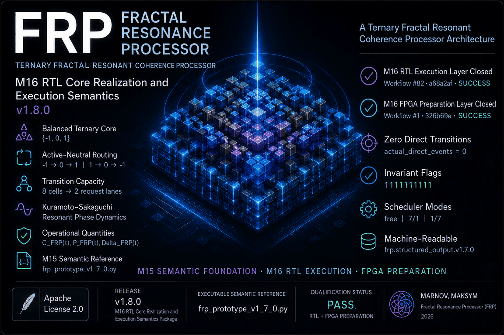

# Fractal Resonance Processor (FRP)

**Ternary Fractal Resonant Coherence Processor**

**Ternary Resonant Coherence Processor — Structured Output Prototype**

Fractal Resonance Processor (FRP) is a **Ternary Fractal Resonant Coherence Processor** reference architecture.

FRP combines two inseparable computational layers:

- resonant phase-coherence dynamics based on the **Kuramoto-Sakaguchi model**;
- the balanced ternary domain `{-1, 0, 1}` for state, target, transition, and retained result.

Each processor cell carries an evolving phase and frequency state.

Computation develops through:

- Kuramoto-Sakaguchi resonant phase interaction;
- asymmetric Sakaguchi phase lag;
- hierarchical fractal coupling;
- phase velocity and phase evolution;
- Kuramoto order parameter `R`;
- multiscale phase coherence;
- stateful delay dynamics;
- local thermal-phase interaction;
- local correlated gamma drift;
- nonlinear coherence compression;
- dynamic stability through `C(t) - P(t)`;
- phase-derived ternary target formation;
- distributed ternary commit;
- mandatory tick-separated routing through the active neutral state `0`;
- retained coherent ternary state.

The balanced ternary layer does not replace the resonant phase-coherence dynamics.

The two layers perform different computational roles:

- the Kuramoto-Sakaguchi and hierarchical resonant layer evolves the computation;
- the balanced ternary domain retains state, target, transition, and result;
- the active neutral state `0` provides the mandatory intermediate state for opposite-polarity transitions.

## Quick Start

Recommended CI-aligned Python version:

`Python 3.12`

Install the repository dependency:

`python -m pip install -r requirements.txt`

Repository external dependency:

`numpy>=1.26.0`

NumPy supports the historical FRP v0.9.3 and v0.9.4 executable layers.

The M15-qualified FRP v1.7.0 executable semantic reference and Comparative Architecture Benchmark Suite use the Python standard library and repository-local modules.

Run the default processor execution:

`python frp_prototype_v1_7_0.py`

Run the explicit demo mode:

`python frp_prototype_v1_7_0.py --mode demo`

Run structured JSON output:

`python frp_prototype_v1_7_0.py --mode demo --output json`

Run structured JSON output with full trace data:

`python frp_prototype_v1_7_0.py --mode demo --output json --include-trace`

Run the M15-qualified executable semantic reference self-test:

`python frp_prototype_v1_7_0.py --mode self-test --output json`

Run the explicit `free` temporal execution mode:

`python frp_prototype_v1_7_0.py --mode self-test --scheduler free --output json`

Run the explicit `7/1` temporal execution mode:

`python frp_prototype_v1_7_0.py --mode self-test --scheduler 7/1 --output json`

Run the explicit `1/7` temporal execution mode:

`python frp_prototype_v1_7_0.py --mode self-test --scheduler 1/7 --output json`

Generate the M15-qualified executable benchmark matrix:

`python frp_prototype_v1_7_0.py --mode benchmark`

Detailed execution references:

- `USAGE.md`;
- `REPRODUCIBILITY.md`;
- `docs/output_schema.md`.

## Current Architecture Layer

| Field | Current value |
|---|---|
| Version | `FRP v1.8.0` |
| Milestone | `M16 — RTL Core Realization and Execution Semantics Package` |
| Executable semantic reference | `frp_prototype_v1_7_0.py` |
| M15 semantic and implementation-mapping qualification | `41 / 41 PASS` |
| M16 RTL execution qualification | `PASS` |
| M16 FPGA preparation qualification | `PASS` |
| Current architecture status | `M16 RTL EXECUTION LAYER CLOSED` |
| Current FPGA status | `M16 FPGA PREPARATION LAYER CLOSED` |

FRP v1.8.0 extends the M15-qualified deterministic implementation-mapping boundary into an executable SystemVerilog RTL core and a target-independent FPGA integration layer.

FRP v1.7.0 extends the published M14 floating semantic reference into a deterministic fixed-point hardware-interface domain.

M15 remains the qualified semantic and implementation-mapping foundation of M16.

The M15 layer provides:

- a deterministic fixed-point interface profile;
- canonical balanced ternary hardware encoding;
- a stateful quantized hardware shadow;
- cycle-exact integer reference traces;
- deterministic RTL comparison vectors;
- SystemVerilog testbench interface mapping;
- synthesizable RTL reference-core mapping;
- RTL assertion correlation;
- reference RTL equivalence;
- exact deterministic replay;
- qualification closure.

The current architecture chain is:

`M14 floating semantic reference → M15 quantized hardware shadow → cycle-exact integer golden trace → deterministic RTL comparison vectors → SystemVerilog correlation contract → RTL equivalence and exact replay → M15 qualification closure → M16 executable SystemVerilog RTL core → M16 target-independent FPGA integration → FPGA preparation qualification closure`

M15 qualification evidence:

- `41 / 41 PASS` self-test assertions;
- `10 / 10` deterministic vector files byte-identical after regeneration;
- `5 / 5` required semantic correlation matches equal to `1.0`;
- `6 / 6` exact deterministic replay matches equal to `1.0`;
- `actual_direct_events = 0`;
- `reserved_state_events = 0`;
- `queue_overflow_events = 0`;
- `fixed_point_topology_sum_exact = True`;
- `fixed_point_thermal_sum_exact = True`.

The current M16 layer adds:

- ten integrated SystemVerilog RTL artifacts;
- executable Verilator elaboration, build, and architectural simulation;
- architectural assertion execution;
- deterministic request-lane arbitration;
- retained pending-route execution;
- active-neutral opposite-polarity routing;
- bounded transition-capacity enforcement;
- retained balanced ternary writeback;
- target-independent FPGA integration;
- asynchronous reset assertion and two-stage synchronous reset release;
- `core_ready` execution gating;
- executable FPGA integration qualification;
- all ten integrated invariant flags equal to `1`;
- zero actual direct-transition, reserved-state, and queue-overflow events.

## FRP v1.8.0 — M16 RTL Core Realization and FPGA Preparation

FRP v1.8.0 M16 introduces the first concrete SystemVerilog RTL realization boundary for the Ternary Fractal Resonant Coherence Processor and closes the target-independent FPGA preparation layer.

The M16 RTL layer preserves the M15-qualified retained-state execution contract and exposes the processor boundary as explicit RTL artifacts under:

`rtl/m16/`

The M16 FPGA preparation layer exposes the qualified core through:

`fpga/m16/`

M16 does not redefine the FRP processor model.

It realizes the already-qualified M15 execution semantics as an executable RTL core and a target-independent FPGA integration boundary.

Primary M16 execution chain:

`phase-derived ternary target`

→ `deterministic request-lane arbitration`

→ `scheduler-qualified transition admission`

→ `pending-route ownership and completion`

→ `transition-capacity guard`

→ `active-neutral routing through 0`

→ `retained balanced ternary writeback`

→ `architectural telemetry and integrated invariants`

→ `FPGA reset synchronization and core-ready execution gating`

Primary preserved invariants:

`actual_direct_events = 0`

`reserved_state_events = 0`

`queue_overflow_events = 0`

### M16 RTL Qualification

Workflow:

`FRP M16 RTL Artifact Boundary`

Workflow file:

`.github/workflows/frp-m16-rtl-artifact-boundary.yml`

Qualified workflow run:

`#88`

Qualified source commit:

`975222b`

Branch:

`main`

Result:

`SUCCESS`

Workflow duration:

`42s`

Closed status:

`M16 RTL EXECUTION LAYER CLOSED`

M16 RTL documentation:

| Path | Purpose |
|---|---|
| `rtl/m16/README.md` | RTL architecture and execution semantics |
| `rtl/m16/ARTIFACTS.md` | RTL artifact manifest |
| `rtl/m16/SIMULATION.md` | Verilator build and execution procedure |
| `rtl/m16/SIMULATION_TRANSCRIPT.md` | final executable qualification record |
| `rtl/m16/CLOSURE.md` | final M16 RTL closure record |

M16 RTL source artifacts:

| Path | Purpose |
|---|---|
| `rtl/m16/frp_m16_pkg.sv` | constants, encodings, types, and helper functions |
| `rtl/m16/frp_m16_scheduler.sv` | `free`, `7/1`, and `1/7` temporal execution |
| `rtl/m16/frp_m16_request_lanes.sv` | deterministic request-lane arbitration |
| `rtl/m16/frp_m16_pending_routes.sv` | retained pending-route register layer |
| `rtl/m16/frp_m16_active_neutral.sv` | active-neutral transition generation |
| `rtl/m16/frp_m16_capacity_guard.sv` | distributed transition-capacity enforcement |
| `rtl/m16/frp_m16_state_update.sv` | retained balanced ternary writeback |
| `rtl/m16/frp_m16_core.sv` | integrated RTL execution core |
| `rtl/m16/frp_m16_assertions.sv` | architectural and temporal assertion layer |
| `rtl/m16/frp_m16_tb.sv` | deterministic executable RTL testbench |

Qualified RTL boundary:

- exact artifact inventory validation;
- SystemVerilog parsing and elaboration;
- executable Verilator testbench generation;
- architectural simulation;
- assertion execution;
- latch and multidriven diagnostic rejection;
- exact `free`, `7/1`, and `1/7` temporal execution;
- active-neutral opposite-polarity routing;
- retained pending-polarity completion;
- deterministic request arbitration;
- bounded transition capacity;
- retained-state writeback;
- ten integrated invariant flags;
- repository-integrity validation;
- uploaded qualification evidence.

### M16 FPGA Preparation Qualification

Workflow:

`FRP M16 FPGA Preparation`

Workflow file:

`.github/workflows/frp-m16-fpga-preparation.yml`

Qualified workflow run:

`#6`

Qualified repository commit:

`975222b`

Branch:

`main`

Result:

`SUCCESS`

Workflow duration:

`38s`

Closed status:

`M16 FPGA PREPARATION LAYER CLOSED`

M16 FPGA preparation artifacts:

| Path | Purpose |
|---|---|
| `fpga/m16/frp_m16_fpga_top.sv` | target-independent FPGA integration and synthesis boundary |
| `fpga/m16/frp_m16_fpga_tb.sv` | executable FPGA integration qualification boundary |
| `fpga/m16/SIMULATION_TRANSCRIPT.md` | final FPGA preparation qualification record |
| `fpga/m16/CLOSURE.md` | final FPGA preparation closure record |

Qualified FPGA preparation boundary:

- exact FPGA artifact inventory validation;
- inherited M16 RTL dependency validation;
- FPGA integration-top elaboration;
- executable FPGA testbench build and execution;
- asynchronous external reset assertion;
- two-stage synchronous reset release;
- `core_ready` generation;
- tick, counter-clear, and request gating before readiness;
- scheduler and request-interface propagation;
- active-neutral route execution;
- retained pending-route completion;
- all ten integrated invariant flags equal to `1`;
- zero actual direct-transition events;
- zero reserved-state events;
- zero queue-overflow events;
- repository-integrity validation;
- uploaded qualification evidence.

## Mathematical and Physical Foundation

The FRP mathematical and physical foundations are documented separately from the implementation and qualification layers.

Mathematical foundation:

`docs/mathematical_foundation.md`

The mathematical foundation defines:

- open nonlinear dissipative dynamics;
- Kuramoto-Sakaguchi coupled-phase evolution;
- phase synchronization and phase coherence as distinct regimes;
- endogenous dynamic stability and criticality;
- resonance-window accessibility and retention;
- recursive inheritance;
- phase-derived balanced ternary qualification;
- active-neutral transition topology;
- scheduler-defined temporal eligibility;
- distributed transition capacity;
- continuous-to-discrete correspondence;
- qualified FRP mathematical invariants.

Physical foundation:

`docs/physical_foundation.md`

The physical foundation defines:

- endogenous structural self-organization;
- phase-organized computation;
- resonance as an endogenous dynamic mechanism;
- active neutral state `0` as an executable balancing and transition state;
- dissipation and thermal feedback as internal processor variables;
- retained history and path dependence;
- fractal hierarchical coupling;
- Binary hardware can model nonlinear dynamics; FRP transfers selected nonlinear dynamic mechanisms into the organization of computation itself;
- the physical evidence boundary of the current FRP repository.

## Processor Architecture

### Computational State and Tick Order

FRP evolves a distributed processor state across discrete ticks.

Each cell maintains:

- balanced ternary state `state_i ∈ {-1, 0, 1}`;
- phase `phase_i`;
- base frequency `base_frequency_i`;
- frequency target `frequency_target_i`;
- current frequency `frequency_current_i`;
- frequency lag `frequency_lag_i`;
- switching activity `switch_activity_i`;
- generated power `generated_power_i`;
- local heat `heat_i`;
- thermal dissipation `thermal_dissipation_i`;
- thermal diffusion `thermal_diffusion_i`;
- thermal overload `thermal_overload_i`;
- correlated gamma-noise state `gamma_noise_state_i`;
- gamma-noise target `gamma_noise_target_i`;
- effective local Sakaguchi phase shift `gamma_effective_i`;
- gamma drift `gamma_drift_i`;
- thermal coupling factor `thermal_node_factor_i`;
- phase-coupling contribution;
- pending neutral-route state.

For each tick, the processor executes the following ordered computational path:

1. determine the temporal execution state;
2. process pending neutral routes;
3. process explicit transition requests;
4. derive phase-based ternary targets;
5. apply the distributed transition-capacity boundary;
6. update switching load;
7. update state-dependent frequency targets and delay dynamics;
8. update distributed local thermal fields;
9. update local correlated gamma drift;
10. update thermal coupling factors;
11. evaluate the resonant phase-coupling field;
12. update phase velocity and phase state;
13. evaluate raw phase coherence;
14. evaluate multiscale phase coherence;
15. evaluate nonlinear coherence compression;
16. calculate `C(t)`, `P(t)`, and `C_minus_P`;
17. retain the resulting ternary processor state and telemetry.

The coupled processor path is therefore:

`ternary state → frequency target → delayed frequency response → local dynamic power → distributed thermal field → local gamma drift → thermally modified Kuramoto-Sakaguchi coupling → phase velocity → phase evolution → multiscale phase coherence → nonlinear coherence compression → C(t) - P(t) → phase-derived ternary target → retained ternary state`

### Balanced Ternary Computational Kernel

The processor state domain is:

`{-1, 0, 1}`

| State | Computational role |
|---|---|
| `-1` | negative / inhibitory / counter-phase / suppressive potential |
| `0` | active neutral balancing / damping / transition / stabilization state |
| `1` | positive / excitatory / phase-supporting / constructive potential |

The neutral state `0` is an active processor state.

It provides:

- logical neutrality;
- phase damping;
- transition buffering;
- conflict neutralization;
- polarity bridging;
- switching-load distribution;
- scheduling control;
- stabilization.

The phase-derived ternary target is determined from:

`x_i = sin(phase_i)`

with:

`target_i = 1`, when `x_i > 0.33`

`target_i = -1`, when `x_i < -0.33`

`target_i = 0`, otherwise.

Opposite-polarity transitions cannot execute directly.

Validated routes are:

`-1 → 0 → 1`

`1 → 0 → -1`

The transition is tick-separated.

For an opposite-polarity request:

`state_i × target_i = -1`

the current tick performs:

`state_i → 0`

and stores:

`pending_route_i = target_i`

The retained target is applied only on a subsequent eligible tick.

Validated invariants:

`actual_direct_events = 0`

`reserved_state_events = 0`

`queue_overflow_events = 0`

### Balanced Ternary Hardware Encoding

The canonical two-bit hardware encoding is:

| Ternary state | Two-bit encoding |
|---|---|
| `-1` | `2'b11` |
| `0` | `2'b00` |
| `1` | `2'b01` |
| reserved | `2'b10` |

The valid processor state domain excludes:

`2'b10`

Validated invariant:

`reserved_state_events = 0`

### Temporal Execution Architecture

FRP preserves three explicit processor execution modes:

`free`

`7/1`

`1/7`

These modes are execution semantics of the processor.

They are preserved across:

- the floating semantic reference;
- the stateful quantized hardware shadow;
- cycle-exact vector generation;
- scheduler-specific qualification;
- SystemVerilog interface mapping;
- the synthesizable RTL reference-core mapping;
- M15 implementation-mapping qualification closure;
- the qualified M16 SystemVerilog execution core;
- the qualified M16 target-independent FPGA integration boundary.

The scheduler-state relations are:

For `free`:

`scheduler_state(tick) = free`

For `7/1`:

`scheduler_state(tick) = commit`, when `(tick + 1) mod 8 = 0`

`scheduler_state(tick) = balance`, otherwise.

For `1/7`:

`scheduler_state(tick) = excite`, when `tick mod 8 = 0`

`scheduler_state(tick) = neutralize`, otherwise.

Validated profiles:

`free: 16 ticks → free = 16`

`7/1: 16 ticks → balance = 14, commit = 2`

`7/1: 64 ticks → balance = 56, commit = 8`

`1/7: 16 ticks → excite = 2, neutralize = 14`

Validated scheduler-count relation:

`sum(scheduler_counts) = ticks_recorded`

The scheduler also contributes a phase-velocity push:

`push = 0.010`, for `commit`

`push = 0.006`, for `excite`

`push = 0.003`, otherwise.

### Transition Capacity and Request-Lane Interface

The distributed transition boundary is defined by:

`transition_fraction = 0.25`

The maximum number of state changes per tick is:

`max_changes = max(1, round(cells × transition_fraction))`

The hardware-facing request-lane relation is:

`REQUEST_LANES = max_changes`

Validated configurations:

| Cells | Request lanes |
|---|---:|
| `8` | `2` |
| `16` | `4` |
| `32` | `8` |

Request lanes are processed in ascending lane order.

The per-tick switching load is:

`switch_load = current_switch_changes / cells`

Validated relation:

`switch_load_peak <= transition_fraction`

Current default boundary:

`switch_load_peak <= 0.25`

### Kuramoto-Sakaguchi Resonant Phase Model

The resonant dynamical foundation of FRP is the **Kuramoto-Sakaguchi phase-coupling model**.

Each cell carries an evolving phase:

`phase_i`

and an evolving internal frequency:

`frequency_current_i`

The nominal Sakaguchi phase shift is:

`gamma_nominal = 0.30 × pi`

The nominal coupling strength is:

`coupling_nominal = 0.28`

For each pair of distinct cells `i` and `j`, the phase interaction is based on:

`sin(phase_j - phase_i - gamma_effective_i)`

The effective pair coupling is:

`K_eff(i,j) = coupling_nominal × W_ij × thermal_pair_factor(i,j)`

The dense reference coupling field is:

`coupling_dense_i = sum_j(K_eff(i,j) × sin(phase_j - phase_i - gamma_effective_i))`

where:

`j != i`

The complete phase velocity is:

`phase_velocity_i = 0.060 × frequency_current_i + scheduler_push + coupling_field_i`

The phase update is:

`phase_i_next = (phase_i + phase_velocity_i) mod 2pi`

The raw global Kuramoto order parameter is evaluated from:

`c = mean_i(cos(phase_i))`

`s = mean_i(sin(phase_i))`

`R = sqrt(c^2 + s^2)`

The processor records:

`raw_phase_coherence = R`

The current implementation uses field names containing the term `phase_coherence`.

Mathematically, these phase-only quantities are phase-order diagnostics.

They do not independently establish full phase-amplitude coherence.

`phase synchronization != phase coherence`

`R(t) != C(t)`

`R(t)` measures phase order.

`R(t)` does not independently measure amplitude coordination.

`R(t)` is not the general endogenous structural coherence `C(t)`.

The Kuramoto-Sakaguchi layer is therefore part of the computational core that determines:

- phase evolution;
- resonance structure;
- phase coherence;
- dynamic stability;
- phase-derived ternary targets;
- subsequent retained ternary state.

### Dyadic Hierarchical Ultrametric Topology

The exact hierarchical topology requires:

`num_cells = 2^L`

where:

`L = hierarchy depth`

Validated scaling configurations:

`8 cells → hierarchy depth 3`

`16 cells → hierarchy depth 4`

`32 cells → hierarchy depth 5`

The hierarchy resolves from individual cells through progressively larger dyadic domains:

`individual cell → pair domain → local cluster → supercluster → global cell domain`

### Hierarchical Ultrametric Distance

For distinct cells `i` and `j`:

`hierarchical_distance(i,j) = bit_length(i XOR j)`

For the same cell:

`hierarchical_distance(i,i) = 0`

For the sixteen-cell reference domain:

`distance(0,1) = 1`

`distance(0,2) = 2`

`distance(0,3) = 2`

`distance(0,4) = 3`

`distance(0,7) = 3`

`distance(0,8) = 4`

`distance(0,15) = 4`

### Shell Population

For hierarchy distance `d`:

`shell_population(d) = 2^(d - 1)`

Validated shell populations:

`8 cells → 1, 2, 4`

`16 cells → 1, 2, 4, 8`

`32 cells → 1, 2, 4, 8, 16`

### Shell-Normalized Fractal Coupling

The raw hierarchical pair weight is:

`W_raw(i,j) = 1 / (2^(d - 1) × d^alpha)`

where:

`d = hierarchical_distance(i,j)`

and:

`i != j`

The diagonal relation is:

`W_raw(i,i) = 0`

The normalized phase-coupling weight is:

`W_ij = W_raw(i,j) / sum_j(W_raw(i,j))`

Validated coupling-topology relations:

`sum_j(W_ij) = 1`

`W_ij = W_ji`

`W_ii = 0`

Current hierarchical scaling exponent:

`fractal_alpha = 0.70`

Each hierarchical shell contains:

`2^(d - 1)`

cells.

Because the raw pair weight contains the shell-population factor:

`2^(d - 1)`

the aggregate influence of shell `d` is proportional to:

`1 / d^alpha`

The aggregate shell influence therefore decreases with hierarchical distance:

`nearest shell → second shell → third shell → highest shell`

Validated marker:

`shell_influence_monotonic = True`

### Phase-Coupling and Thermal-Diffusion Topology Separation

FRP preserves two independent hierarchical interaction paths.

Phase-coupling topology:

`W_ij`

Thermal-diffusion topology:

`T_ij`

The phase-coupling topology controls:

- Kuramoto-Sakaguchi phase interaction;
- hierarchical phase-coherence propagation;
- local coupling dominance;
- cross-cluster phase influence.

The thermal-diffusion topology controls:

- local heat propagation;
- inter-cell thermal diffusion;
- cross-cluster thermal leakage;
- hotspot containment.

The architecture does not require:

`W_ij = T_ij`

### Thermal-Diffusion Topology

Current thermal hierarchical scaling exponent:

`thermal_beta = 1.20`

The raw thermal pair relation is:

`T_raw(i,j) = 1 / (2^(d - 1) × d^beta)`

where:

`d = hierarchical_distance(i,j)`

and:

`i != j`

The diagonal relation is:

`T_raw(i,i) = 0`

The normalized thermal-diffusion weight is:

`T_ij = T_raw(i,j) / sum_j(T_raw(i,j))`

Validated thermal-topology relations:

`sum_j(T_ij) = 1`

`T_ij = T_ji`

`T_ii = 0`

Validated thermal-topology markers:

`row_sum_match = True`

`symmetry_match = True`

`diagonal_zero = True`

`shell_influence_monotonic = True`

### Cluster-Local Thermal Field

FRP maintains a distributed thermal state for every cell.

Each cell carries:

`heat_i`

`generated_power_i`

`thermal_dissipation_i`

`thermal_diffusion_i`

`thermal_overload_i`

`heat_peak_i`

The inherited global heat telemetry is:

`heat = mean_i(heat_i)`

The global heat peak is:

`heat_peak = max_t(heat)`

The local heat peak is:

`local_heat_peak = max_i,t(heat_i)`

### Local Dynamic Power Generation

For each cell `i`:

`generated_power_i = base_power_cell + switch_power_gain × switch_activity_i + lag_power_gain × frequency_lag_i`

The local dynamic-power path is:

`local state transition → local switching activity → local frequency target displacement → local frequency lag → local dynamic power generation`

### Hierarchical Thermal Diffusion

For each cell `i`:

`thermal_diffusion_i = thermal_diffusion_gain × sum_j(T_ij × (heat_j - heat_i))`

The local heat update is:

`heat_i_next = max(ambient_heat, heat_i + generated_power_i - thermal_dissipation_i + thermal_diffusion_i)`

The thermal path is:

`local generated power → local heat accumulation → local thermal dissipation → hierarchical thermal diffusion → neighbor-domain heating → cross-cluster thermal propagation`

### Local Thermal Overload

For each cell `i`:

`thermal_overload_i = max(0, heat_i - thermal_soft_limit)`

The processor retains local thermal telemetry for:

- per-cell heat;
- per-cell thermal overload;
- per-cluster mean heat;
- per-cluster peak heat;
- active-cluster heat peak;
- inactive-cluster heat mean;
- remote-cluster heat peak;
- cross-cluster thermal propagation ratio.

### Factorized Thermal Coupling Degradation

For each cell `i`:

`thermal_node_factor_i = exp(-0.5 × thermal_coupling_gain × thermal_overload_i)`

For cells `i` and `j`:

`thermal_pair_factor(i,j) = thermal_node_factor_i × thermal_node_factor_j`

The effective pair coupling is:

`K_eff(i,j) = coupling_nominal × W_ij × thermal_pair_factor(i,j)`

Equivalent relation:

`K_eff(i,j) = coupling_nominal × W_ij × exp(-thermal_coupling_gain × (thermal_overload_i + thermal_overload_j) / 2)`

The complete pair interaction therefore couples:

- nominal Kuramoto-Sakaguchi interaction strength;
- hierarchical fractal weight `W_ij`;
- local thermal overload of cell `i`;
- local thermal overload of cell `j`;
- local effective Sakaguchi phase shift.

The interaction term is:

`K_eff(i,j) × sin(phase_j - phase_i - gamma_effective_i)`

### Local Correlated Gamma Drift

Each cell maintains:

`gamma_noise_state_i`

`gamma_noise_target_i`

`gamma_effective_i`

`gamma_drift_i`

The correlated gamma-noise state evolves as:

`gamma_noise_next_i = gamma_noise_state_i + gamma_correlation_alpha × (gamma_noise_target_i - gamma_noise_state_i)`

The effective local Sakaguchi phase shift is:

`gamma_effective_i = gamma_nominal + gamma_thermal_gain × thermal_overload_i × gamma_noise_state_i`

The local gamma drift is:

`gamma_drift_i = gamma_effective_i - gamma_nominal`

The nominal Sakaguchi phase shift remains:

`gamma_nominal = 0.30 × pi`

The local interaction phase term therefore becomes:

`sin(phase_j - phase_i - gamma_effective_i)`

rather than:

`sin(phase_j - phase_i - gamma_nominal)`

The local gamma path is:

`thermal overload → correlated gamma-noise state → local effective Sakaguchi phase shift → asymmetric local phase interaction`

### Dense Reference Interaction Path

The dense reference path evaluates every pair of distinct cells.

For each cell `i`:

`coupling_dense_i = sum_j(K_eff(i,j) × sin(phase_j - phase_i - gamma_effective_i))`

where:

`j != i`

The dense reference path preserves:

- exact pairwise hierarchical weights;
- exact pairwise thermal factors;
- exact local gamma shift;
- exact phase difference;
- complete cross-cell interaction.

Computational scaling:

`O(N^2)`

The dense path remains the exact reference interaction path used for correlation against the hierarchical accelerated path.

### Hierarchical Accelerated Interaction Path

The hierarchical accelerated path uses the exact dyadic topology to aggregate interaction domains.

The interaction hierarchy is:

`leaf phase states → pair-domain reduction → cluster reduction → supercluster reduction → global-domain reduction → per-cell shell lookup → hierarchical coupling accumulation`

For each cell, the interaction field is reconstructed through hierarchical shells rather than by explicitly traversing every pair.

The hierarchy preserves the same dyadic domain structure used by:

- `hierarchical_distance(i,j)`;
- `shell_population(d)`;
- `W_ij`;
- multiscale phase-order domains.

The computational scaling target is:

`O(N log N)`

The hierarchical path is therefore the accelerated implementation path, while the dense path remains the exact reference path.

### Dense-Hierarchical Equivalence

FRP validates the dense reference interaction path against the hierarchical accelerated interaction path.

The required topology relation is:

`topology_match = 1.000`

The equivalence conditions are:

`max_coupling_error <= equivalence_tolerance`

`max_phase_velocity_error <= equivalence_tolerance`

`max_phase_error <= equivalence_tolerance`

The equivalence path is validated across:

- the default configuration;
- `7/1`;
- `1/7`.

The architecture therefore preserves one semantic interaction model across:

`dense exact reference → hierarchical accelerated execution`

without changing the processor coupling topology.

### Multiscale Phase-Order Map

FRP evaluates phase-order diagnostics across the same dyadic hierarchy used by the coupling topology.

For a dyadic group `G`:

`R_G = magnitude(mean_i(exp(i × phase_i)))`

Equivalent real-component form:

`c_G = mean_i(cos(phase_i))`

`s_G = mean_i(sin(phase_i))`

`R_G = sqrt(c_G^2 + s_G^2)`

For the sixteen-cell reference configuration:

`group size 2 → group count 8`

`group size 4 → group count 4`

`group size 8 → group count 2`

`group size 16 → group count 1`

The hierarchy therefore evaluates:

- pair-domain phase order;
- cluster phase order;
- supercluster phase order;
- global phase order.

The implementation retains the following telemetry field names for output compatibility:

- `pair_domain_coherence_mean`;
- `pair_domain_coherence_min`;
- `cluster_coherence_mean`;
- `cluster_coherence_min`;
- `supercluster_coherence_mean`;
- `supercluster_coherence_min`;
- `global_phase_coherence`;
- `coherence_dispersion_across_clusters`.

These fields are calculated from phase-only Kuramoto order parameters.

Mathematically, these phase-only quantities are phase-order diagnostics.

They do not independently establish full phase-amplitude coherence.

The global Kuramoto order parameter remains:

`R = sqrt(c^2 + s^2)`

where:

`c = mean_i(cos(phase_i))`

`s = mean_i(sin(phase_i))`

The processor records:

`raw_phase_coherence = R`

The field name is retained for output compatibility.

The mathematical quantity remains a phase-order magnitude.

The local-to-global phase-order structure is:

`cell phase`

→ `pair-domain phase order`

→ `cluster phase order`

→ `supercluster phase order`

→ `global phase order`

The architecture is therefore:

`locally phase-organized`

→ `hierarchically coupled`

→ `globally adaptive`

### State-Dependent Delay Dynamics

FRP maintains a delayed internal frequency response for every cell.

Each cell carries:

`base_frequency_i`

`frequency_target_i`

`frequency_current_i`

`frequency_lag_i`

The frequency target is:

`frequency_target_i = base_frequency_i + state_frequency_gain × abs(state_i) + switching_frequency_gain × switch_activity_i`

The internal frequency response is:

`frequency_next_i = frequency_current_i + delay_alpha × (frequency_target_i - frequency_current_i)`

The remaining frequency lag is:

`frequency_lag_i = abs(frequency_target_i - frequency_current_i)`

The delay path is:

`retained ternary state`

→ `state-dependent frequency target`

→ `switching-dependent frequency target displacement`

→ `partial internal frequency response`

→ `residual frequency lag`

→ `subsequent tick inheritance`

→ `progressive frequency convergence`

The processor therefore does not force the internal frequency state to reach its target instantaneously.

The lagged frequency state contributes directly to:

- local dynamic power generation;
- thermal accumulation;
- subsequent phase velocity;
- future phase evolution.

Current reference relation:

`frequency_target_i = base_frequency_i + 0.06 × abs(state_i) + 0.12 × switch_activity_i`

Current delayed update:

`frequency_next_i = frequency_current_i + 0.30 × (frequency_target_i - frequency_current_i)`

### Global Thermal Saturation Relation

The inherited global thermal telemetry is:

`heat = mean_i(heat_i)`

The global generated power is:

`generated_power = mean_i(generated_power_i)`

The global thermal dissipation relation is:

`thermal_dissipation = (heat - ambient_heat) / thermal_time_constant`

The global thermal overload is:

`thermal_overload = max(0, heat - thermal_soft_limit)`

The global heat peak is:

`heat_peak = max_t(heat)`

The local heat peak is:

`local_heat_peak = max_i,t(heat_i)`

The global thermal relation preserves the aggregate view of the distributed local thermal field.

Current reference parameters:

| Parameter | Value |
|---|---:|
| `ambient_heat` | `0.05` |
| `thermal_time_constant` | `14.0` |
| `thermal_soft_limit` | `0.22` |
| `thermal_hard_limit` | `0.90` |
| `thermal_diffusion_gain` | `0.035` |
| `thermal_coupling_gain` | `2.50` |

Thermal state participates in endogenous processor feedback.

### Nonlinear Phase-Order Compression

FRP couples thermal overload and reduced stability margin to nonlinear compression of the phase-order support field.

The implementation field is:

`coherence_compression`

The margin pressure is:

`margin_pressure = max(0, stability_soft_margin - previous_C_minus_P)`

The nonlinear compression relation is:

`coherence_compression = exp(-(thermal_compression_gain × thermal_overload^2 + margin_compression_gain × margin_pressure^2))`

The effective phase-order support is:

`effective_coherence = raw_phase_coherence × coherence_compression`

The implementation field names are retained for output compatibility.

Mathematically:

- `raw_phase_coherence` is the global Kuramoto phase-order magnitude;
- `coherence_compression` is the nonlinear operational compression factor;
- `effective_coherence` is the compressed phase-order support quantity;
- these phase-only quantities do not independently establish complete phase-amplitude coherence.

The compression path is:

`raw phase order`

→ `thermal overload`

→ `reduced inherited stability margin`

→ `nonlinear compression pressure`

→ `exponential phase-order compression`

→ `effective processor coherence support`

The nonlinear compression layer couples:

- current phase synchronization;
- accumulated thermal pressure;
- inherited operational stability margin;
- subsequent processor-state qualification.

### Operational Processor Coherence Support

The implementation exposes the field:

`C`

To distinguish the processor-specific operational quantity from general endogenous structural coherence `C(t)`, this README denotes it as:

`C_FRP(t)`

The processor-specific operational coherence-support quantity is derived from:

- compressed global phase order;
- hierarchical phase-order support;
- active-neutral-state contribution;
- retained frequency-lag pressure.

The current operational relation is:

`C_FRP(t) = 0.82 + 0.34 × effective_coherence + 0.16 × cluster_coherence_mean + 0.08 × neutral_fraction - 0.10 × mean_frequency_lag`

where:

`effective_coherence = raw_phase_coherence × coherence_compression`

and:

`raw_phase_coherence = R`

The implementation field remains:

`C`

`operational C_FRP(t) != general C(t)`

`C_FRP` is a processor-specific operational quantity.

### Operational Destabilizing Load

The implementation exposes the field:

`P`

This README denotes the processor-specific operational quantity as:

`P_FRP(t)`

The current destabilizing-load relation is:

`P_FRP(t) = heat + switch_load`

where:

`heat = mean_i(heat_i)`

and:

`switch_load = current_switch_changes / cells`

The operational destabilizing load therefore combines:

- accumulated thermal pressure;
- current distributed switching pressure.

The implementation field remains:

`P`

`operational P_FRP(t) != every possible physical P(t)`

`P_FRP` is a processor-specific destabilizing-load projection.

### Operational Stability Margin

The implementation exposes:

`C_minus_P`

This README denotes the processor-specific stability margin as:

`Delta_FRP(t) = C_FRP(t) - P_FRP(t)`

The operational stability condition is:

`Delta_FRP(t) > 0`

Equivalent processor relation:

`C_FRP(t) > P_FRP(t)`

The processor records:

- implementation field `C`;
- implementation field `P`;
- implementation field `C_minus_P`;
- `C_minus_P_min`;
- `C_minus_P_final`.

The complete operational stability path is:

`Kuramoto-Sakaguchi phase evolution`

→ `global and multiscale phase order`

→ `thermal and inherited-margin compression pressure`

→ `effective processor coherence support`

→ `C_FRP(t)`

→ `heat + switching load`

→ `P_FRP(t)`

→ `Delta_FRP(t)`

→ `phase-derived ternary target`

→ `distributed retained-state execution`

The validated M15 reference profile preserves:

`minimum Delta_FRP(t) > 0`

The wider stability principle is:

`C(t) > P(t)`

### Hardware-Facing Numeric Profile

The M15-qualified semantic and implementation-mapping reference retained by FRP v1.8.0 maps the floating processor architecture into deterministic finite-word hardware-facing representations.

The primary numeric domains are:

`S32Q16`

`S32Q30`

`PHASE_U32`

`GAMMA_S32`

General dynamic scalar type:

`S32Q16`

Normalized coefficient type:

`S32Q30`

Binary phase type:

`PHASE_U32`

Sakaguchi gamma phase-offset type:

`GAMMA_S32`

The hardware-facing numeric layer preserves:

- balanced ternary state semantics;
- phase evolution;
- hierarchical coupling;
- thermal diffusion;
- local gamma drift;
- multiscale phase-order diagnostics;
- operational stability;
- pending active-neutral routes;
- temporal execution modes.

This finite-word profile forms the deterministic semantic basis inherited by the M16 RTL realization.

### Deterministic Quantization

The quantization rule is:

`round-to-nearest with half cases away from zero`

For a nonnegative scaled value `x`:

`quantized = floor(x + 0.5)`

For a negative scaled value `x`:

`quantized = ceil(x - 0.5)`

The fixed-point layer validates:

- positive half-case rounding;
- negative half-case rounding;
- signed saturation;
- fixed-point multiplication;
- phase wrapping.

The finite-word mapping is deterministic.

Identical input state, parameters, initial conditions, and deterministic stimulus therefore produce identical quantized output state.

### Exact Q30 Hierarchical Closure

The phase-coupling topology is quantized into Q30 coefficients.

The exact aggregate phase-topology relation is:

`sum_d(shell_population(d) × W_level_q[d]) = 2^30`

The thermal-diffusion topology is independently quantized into Q30 coefficients.

The exact aggregate thermal-topology relation is:

`sum_d(shell_population(d) × T_level_q[d]) = 2^30`

Validated invariants:

`fixed_point_topology_sum_exact = True`

`fixed_point_thermal_sum_exact = True`

The quantized hierarchical topology therefore preserves exact normalized closure in the integer hardware domain.

The phase-coupling and thermal-diffusion coefficient domains remain independently normalized.

### Deterministic Trigonometric Profile

The finite-word resonant phase model uses a deterministic full-cycle trigonometric lookup profile.

Validated lookup-table size:

`4096 entries`

Validated lookup address width:

`12 bits`

The phase word is:

`PHASE_U32`

The lookup index is:

`lut_index = phase_word >> 20`

The sine table is defined by:

`sin_lut[k] = quantize_q30(sin(2 pi k / 4096))`

The cosine table is derived from the quarter-cycle offset:

`cos_lut[k] = sin_lut[(k + 1024) mod 4096]`

The lookup path is:

`PHASE_U32`

→ `12-bit LUT index`

→ `Q30 sine or cosine value`

→ `quantized Kuramoto-Sakaguchi interaction`

The deterministic trigonometric profile preserves the phase-coupling path without runtime floating-point trigonometric evaluation.

For an identical phase word, the lookup path produces an identical finite-word result.

### Quantized Kuramoto-Sakaguchi Interaction

The floating interaction term:

`sin(phase_j - phase_i - gamma_effective_i)`

is mapped into the finite-word phase domain.

The quantized phase-difference path is:

`phase_j_q - phase_i_q - gamma_effective_i_q`

followed by:

`phase wrapping`

→ `LUT index extraction`

→ `Q30 sine lookup`

→ `fixed-point pair weighting`

The quantized effective pair interaction retains:

`coupling_nominal_q`

× `W_ij_q`

× `thermal_pair_factor_q`

× `sin_lut_q`

The quantized architecture therefore preserves the same computational order as the floating semantic reference:

`hierarchical weight`

→ `thermal pair degradation`

→ `local Sakaguchi phase offset`

→ `relative-phase interaction`

→ `coupling accumulation`

The quantized relation is a deterministic finite-word representation of the floating Kuramoto-Sakaguchi processor interaction.

It forms part of the M15 semantic reference inherited by the M16 RTL execution boundary.

### Stateful Quantized Hardware Shadow Model

The M15 quantized hardware shadow retained by FRP v1.8.0 is a stateful finite-word execution path.

The quantized state generated at tick `N` becomes the input state for tick `N + 1`.

Validated relation:

`quantized state at tick N`

→ `input state for quantized tick N + 1`

The shadow model retains quantized forms of:

- balanced ternary states;
- phases;
- current frequencies;
- frequency targets;
- frequency lags;
- local heat;
- thermal overload;
- gamma-noise state;
- effective local gamma;
- pending active-neutral routes;
- scheduler state;
- transition counters;
- phase-order telemetry;
- operational stability telemetry.

Cycle-exact hardware-facing vectors are generated from:

`quantized_reference_shadow_model`

The hardware shadow is not a stateless conversion of floating outputs.

It is a persistent processor execution path whose quantized internal state is inherited from tick to tick.

The M15 shadow remains the finite-word semantic reference inherited by the M16 RTL realization.

### Cycle-Exact Integer Golden Trace

The M15 cycle-exact trace is generated from the stateful quantized hardware shadow.

The trace preserves the processor state at each tick in deterministic integer form.

For every recorded cycle, the trace contains:

- tick index;
- scheduler state;
- balanced ternary cell state;
- phase word;
- current frequency;
- frequency target;
- frequency lag;
- local heat;
- thermal overload;
- gamma-noise state;
- effective local gamma;
- pending active-neutral route state;
- request-lane state;
- transition counters;
- raw phase-order magnitude;
- multiscale phase-order diagnostics;
- operational `C`;
- operational `P`;
- operational `C_minus_P`.

The cycle-exact progression is:

`initial quantized state`

→ `quantized tick execution`

→ `cycle N integer state`

→ `cycle N state retained`

→ `cycle N + 1 integer execution`

The trace acts as the integer golden reference for downstream RTL comparison.

### Deterministic RTL Comparison Vector Package

The RTL comparison-vector package is derived directly from the cycle-exact integer golden trace.

The vector package preserves:

- input state;
- expected output state;
- scheduler state;
- request-lane ordering;
- pending-route state;
- phase state;
- frequency state;
- thermal state;
- gamma state;
- phase-order state;
- operational stability state;
- transition counters.

The comparison path is:

`stateful quantized hardware shadow`

→ `cycle-exact integer golden trace`

→ `deterministic RTL comparison vectors`

The vector package is deterministic.

For identical:

- processor parameters;
- seed;
- temporal execution mode;
- initial state;
- deterministic stimulus;

the generated vector files must be byte-identical.

Validated regeneration result:

`10 / 10 vector files byte-identical`

Validated package digest:

`703dd4b56f4b34289a2c5bc5521ad4ddc3113bdec8c38238c3244c69cb4d58df`

### SystemVerilog Testbench Interface Mapping

The SystemVerilog testbench interface maps the M15 vector package into explicit RTL comparison signals.

The interface preserves:

- balanced ternary state encoding;
- phase words;
- frequency words;
- thermal words;
- gamma words;
- scheduler state;
- request lanes;
- pending active-neutral routes;
- transition counters;
- phase-order telemetry;
- operational stability telemetry.

The comparison contract is:

`vector input`

→ `RTL tick execution`

→ `observed RTL output`

→ `cycle-exact golden comparison`

The interface preserves the processor execution semantics across:

`Python semantic reference`

→ `quantized hardware shadow`

→ `integer golden trace`

→ `SystemVerilog comparison boundary`

### Synthesizable RTL Reference-Core Mapping

The M15 synthesizable RTL reference-core mapping defines the processor execution contract as a hardware-oriented sequential structure.

The reference-core mapping preserves:

- canonical balanced ternary encoding;
- explicit temporal execution modes;
- deterministic request-lane ordering;
- transition-capacity limits;
- retained pending routes;
- mandatory active-neutral routing;
- tick-separated opposite-polarity transitions;
- retained processor state.

The reference-core relation is:

`current retained state`

→ `scheduler state`

→ `pending-route evaluation`

→ `request-lane evaluation`

→ `transition-capacity enforcement`

→ `active-neutral transition processing`

→ `next retained state`

The reference-core mapping is aligned with the ternary transition semantics used by the executable processor reference.

The M15 reference-core mapping provides the qualified architecture contract realized by the M16 integrated SystemVerilog RTL core.

### RTL Assertion Correlation Harness

The assertion-correlation harness validates processor invariants at the M15 RTL comparison boundary.

Required assertions include:

`actual_direct_events = 0`

`reserved_state_events = 0`

`queue_overflow_events = 0`

`accepted_changes <= REQUEST_LANES`

`switch_load_peak <= transition_fraction`

`pending routes preserve requested target polarity`

`opposite-polarity transitions pass through 0`

`scheduler counts match ticks recorded`

The assertion path is:

`cycle-exact vector`

→ `RTL execution contract`

→ `signal observation`

→ `invariant assertion`

→ `correlation result`

The harness validates processor semantics in addition to output-state correspondence.

### Reference RTL Equivalence

The M15 equivalence layer compares the reference RTL execution contract with the quantized hardware shadow.

Required semantic correlation matches are:

`state_sequence_match = 1.000`

`scheduler_sequence_match = 1.000`

`neutral_route_sequence_match = 1.000`

`C_minus_P_sign_match = 1.000`

`boundary_order_match = 1.000`

Validated result:

`5 / 5 required semantic matches = 1.0`

The equivalence layer checks:

- retained-state order;
- temporal execution order;
- active-neutral route order;
- operational stability-sign preservation;
- transition-boundary order.

### Exact Deterministic Quantized-Shadow Replay

The M15 replay layer regenerates the quantized execution from the retained deterministic state.

Required replay matches are:

`shadow_replay_state_match = 1.000`

`shadow_replay_scheduler_match = 1.000`

`shadow_replay_pending_route_match = 1.000`

`shadow_replay_counter_match = 1.000`

`shadow_replay_trace_match = 1.000`

`shadow_replay_cell_trace_match = 1.000`

Validated result:

`6 / 6 replay matches = 1.0`

The replay path is:

`retained quantized initial state`

→ `deterministic tick execution`

→ `regenerated processor trace`

→ `exact comparison with reference trace`

### M15 Qualification Closure

The M15 qualification-closure layer combines:

- fixed-point interface qualification;
- balanced ternary encoding qualification;
- quantized-shadow qualification;
- cycle-exact trace qualification;
- RTL vector-package qualification;
- SystemVerilog interface qualification;
- synthesizable RTL reference-core mapping;
- assertion correlation;
- reference RTL equivalence;
- exact deterministic replay.

Qualified result:

`PASS`

Validated self-test result:

`41 / 41 PASS`

Validated deterministic vector regeneration:

`10 / 10 vector files byte-identical`

Validated semantic correlation:

`5 / 5 required semantic matches = 1.0`

Validated deterministic replay:

`6 / 6 replay matches = 1.0`

Preserved execution invariants:

`actual_direct_events = 0`

`reserved_state_events = 0`

`queue_overflow_events = 0`

The complete M15 implementation-mapping path is:

`M14 floating semantic reference`

→ `M15 deterministic fixed-point interface`

→ `stateful quantized hardware shadow`

→ `cycle-exact integer golden trace`

→ `deterministic RTL comparison vectors`

→ `SystemVerilog correlation interface`

→ `synthesizable RTL reference-core mapping`

→ `RTL assertion correlation`

→ `reference RTL equivalence`

→ `exact deterministic replay`

→ `M15 qualification closure`

The closed M15 layer remains the semantic and implementation-mapping foundation of the current M16 RTL execution architecture.

### Scaling Qualification

The M15 hardware-facing architecture inherited by FRP v1.8.0 is qualified across three exact dyadic processor sizes:

`8 cells`

`16 cells`

`32 cells`

Validated scaling profiles:

| Cells | Hierarchy depth | Request lanes | Packed state width |
|---|---:|---:|---:|
| `8` | `3` | `2` | `16 bits` |
| `16` | `4` | `4` | `32 bits` |
| `32` | `5` | `8` | `64 bits` |

The scaling relations are:

`hierarchy_depth = log2(cells)`

`request_lanes = max(1, round(cells × transition_fraction))`

with:

`transition_fraction = 0.25`

The balanced ternary packed-state width is:

`packed_state_width = 2 × cells`

because each ternary state is represented by the canonical two-bit encoding.

Validated profiles:

`8 cells → hierarchy depth 3 → request lanes 2 → packed state width 16 bits`

`16 cells → hierarchy depth 4 → request lanes 4 → packed state width 32 bits`

`32 cells → hierarchy depth 5 → request lanes 8 → packed state width 64 bits`

Every validated scaling profile preserves:

`actual_direct_events = 0`

`reserved_state_events = 0`

`queue_overflow_events = 0`

`balanced_ternary_state_domain = True`

`fixed_point_topology_sum_exact = True`

`fixed_point_thermal_sum_exact = True`

The processor therefore preserves the same computational semantics across the validated scaling set:

`balanced ternary state domain`

→ `free / 7/1 / 1/7 temporal execution`

→ `Kuramoto-Sakaguchi phase interaction`

→ `dyadic hierarchical coupling`

→ `distributed thermal field`

→ `multiscale phase-order diagnostics`

→ `operational dynamic stability`

→ `distributed ternary commit`

→ `mandatory active-neutral routing`

→ `retained balanced ternary state`

Validation result:

`PASS`

### M15 Architecture Artifacts

The M15 implementation package contains ten validated architecture layers:

| Artifact layer | Role |
|---|---|
| `fixed_point_interface_profile` | deterministic finite-word interface definition |
| `balanced_ternary_hardware_encoding_map` | canonical two-bit ternary encoding |
| `quantized_reference_shadow_model` | stateful finite-word processor execution |
| `cycle_exact_reference_trace` | integer golden execution trace |
| `rtl_comparison_vector_package` | deterministic RTL comparison vectors |
| `systemverilog_testbench_interface_map` | SystemVerilog comparison interface |
| `synthesizable_rtl_reference_core` | synthesizable reference-core mapping |
| `rtl_assertion_correlation_harness` | invariant and correlation contract |
| `reference_rtl_equivalence_report` | reference-side equivalence evidence |
| `qualification_closure_manifest` | M15 qualification closure |

The M15 architecture chain is:

`published M14 semantic reference`

→ `deterministic fixed-point interface`

→ `balanced ternary hardware encoding`

→ `stateful quantized hardware shadow`

→ `cycle-exact integer golden trace`

→ `deterministic RTL comparison vectors`

→ `SystemVerilog interface mapping`

→ `synthesizable RTL reference-core mapping`

→ `RTL assertion correlation`

→ `reference RTL equivalence`

→ `exact deterministic replay`

→ `M15 qualification closure`

### M15 Architecture Files

M15 architecture document:

`docs/m15_implementation_mapping_domain_interface_qualification_closure.md`

M15 executable semantic reference:

`frp_prototype_v1_7_0.py`

M15 workflow:

`.github/workflows/frp-m15-implementation-mapping-qualification.yml`

M15 release evidence:

- `RELEASE_NOTES_v1_7_0.md`;
- `TEST_REPORT_v1_7_0.md`;
- `FRP_VALIDATION_INDEX_v1_7_0.md`;
- `CHANGELOG.md`.

The closed M15 layer remains the deterministic semantic and implementation-mapping foundation inherited by M16.

### M16 RTL Execution Boundary

FRP v1.8.0 M16 begins at the phase-derived balanced ternary target boundary.

The upstream floating semantic reference continues to define:

- Kuramoto-Sakaguchi phase evolution;
- hierarchical fractal coupling;
- stateful frequency delay;
- distributed thermal dynamics;
- local gamma drift;
- multiscale phase-order diagnostics;
- operational `C_FRP(t) - P_FRP(t)`;
- phase-derived ternary target formation.

The M16 RTL core realizes the retained balanced ternary execution semantics that follow target formation.

The executable M16 RTL chain is:

`phase-derived balanced ternary target`

→ `temporal scheduler state`

→ `pending-route completion priority`

→ `deterministic request-lane arbitration`

→ `balanced ternary transition classification`

→ `active-neutral transition generation`

→ `distributed transition-capacity admission`

→ `pending-route register update`

→ `retained balanced ternary writeback`

→ `architectural telemetry`

→ `integrated invariant evaluation`

M16 does not redefine the qualified M15 processor semantics.

It converts the retained-state execution contract into an integrated executable SystemVerilog boundary.

### M16 SystemVerilog Artifact Boundary

The closed RTL source boundary is:

`rtl/m16/`

It contains ten SystemVerilog artifacts:

| File | Function |
|---|---|
| `rtl/m16/frp_m16_pkg.sv` | canonical balanced ternary encoding, scheduler types, transition classes, invariant indexes, and shared functions |
| `rtl/m16/frp_m16_scheduler.sv` | `free`, `7/1`, and `1/7` temporal execution |
| `rtl/m16/frp_m16_request_lanes.sv` | deterministic ascending request-lane arbitration |
| `rtl/m16/frp_m16_pending_routes.sv` | retained pending-polarity creation, ownership, retention, completion, and clearing |
| `rtl/m16/frp_m16_active_neutral.sv` | active-neutral transition generation |
| `rtl/m16/frp_m16_capacity_guard.sv` | distributed transition-capacity admission |
| `rtl/m16/frp_m16_state_update.sv` | retained balanced ternary state writeback |
| `rtl/m16/frp_m16_core.sv` | integrated M16 RTL execution and synthesis boundary |
| `rtl/m16/frp_m16_assertions.sv` | architectural, temporal, routing, capacity, domain, and writeback assertions |
| `rtl/m16/frp_m16_tb.sv` | deterministic executable architectural testbench |

The RTL documentation boundary contains:

| File | Function |
|---|---|
| `rtl/m16/README.md` | M16 RTL architecture and execution semantics |
| `rtl/m16/ARTIFACTS.md` | RTL artifact manifest |
| `rtl/m16/SIMULATION.md` | Verilator build and execution procedure |
| `rtl/m16/SIMULATION_TRANSCRIPT.md` | final executable qualification record |
| `rtl/m16/CLOSURE.md` | final M16 RTL closure record |

### M16 Balanced Ternary Execution Semantics

The retained processor-state domain is:

`{-1, 0, 1}`

Canonical encoding:

| Ternary state | Encoding |
|---|---|
| `-1` | `2'b11` |
| `0` | `2'b00` |
| `1` | `2'b01` |
| reserved | `2'b10` |

The state `0` remains an active processor state.

It performs:

- logical neutrality;
- balancing;
- damping;
- transition buffering;
- conflict neutralization;
- polarity bridging;
- switching-load distribution;
- retained-state stabilization;
- temporal execution control.

Opposite-polarity retained-state transitions are excluded:

`-1 → 1`

`1 → -1`

The required routes are:

`-1 → 0 → 1`

`1 → 0 → -1`

For an opposite-polarity request:

1. the requested direct event is detected;
2. direct retained-state writeback is prevented;
3. the retained state moves to active neutral `0`;
4. the exact requested polarity is stored in the pending route;
5. completion waits for a subsequent eligible tick;
6. completion executes only from retained state `0`;
7. the pending route clears after accepted completion.

### M16 Temporal Execution

The M16 core preserves three temporal execution modes:

- `free`;
- `7/1`;
- `1/7`.

The scheduler controls whether the current tick is:

- commit-capable;
- neutralize-capable;
- both commit-capable and neutralize-capable.

The retained scheduler counters preserve the number of executed ticks in each scheduler state.

Validated scheduler relation:

`sum(scheduler_state_counts) = ticks_recorded`

### M16 Request-Lane Arbitration

Explicit request lanes are evaluated in deterministic ascending order:

`lane 0 → lane 1 → ... → lane REQUEST_LANES - 1`

The request boundary preserves:

- valid cell-index qualification;
- canonical balanced ternary target qualification;
- one accepted explicit request per cell per tick;
- earlier accepted-lane ownership;
- retained pending-route ownership;
- scheduler eligibility;
- transition-capacity eligibility;
- separate acceptance and rejection results.

Pending-route completion candidates receive priority before explicit request lanes.

The arbitration path is deterministic for an identical retained state and identical request input.

### M16 Transition-Capacity Enforcement

The retained transition-capacity relation is:

`REQUEST_LANES = max(1, round(CELLS × 0.25))`

The capacity relations are:

`accepted_changes <= REQUEST_LANES`

`capacity_remaining = REQUEST_LANES - accepted_changes`

`capacity_exhausted = 1`, when `accepted_changes = REQUEST_LANES`

`switch_load_numerator = accepted_changes`

Each accepted state-changing route leg consumes transition capacity on its own tick.

Same-state retention consumes no transition capacity.

### M16 Integrated Invariant Boundary

The integrated M16 core exposes ten invariant flags:

| Index | Invariant |
|---:|---|
| `0` | `FRP_INV_STATE_DOMAIN_VALID` |
| `1` | `FRP_INV_SCHEDULER_COUNTS_VALID` |
| `2` | `FRP_INV_REQUEST_LANE_ORDER_VALID` |
| `3` | `FRP_INV_PENDING_POLARITY_VALID` |
| `4` | `FRP_INV_ACTIVE_NEUTRAL_VALID` |
| `5` | `FRP_INV_TRANSITION_CAPACITY_VALID` |
| `6` | `FRP_INV_STATE_UPDATE_VALID` |
| `7` | `FRP_INV_NO_ACTUAL_DIRECT_EVENTS` |
| `8` | `FRP_INV_NO_RESERVED_STATE` |
| `9` | `FRP_INV_NO_QUEUE_OVERFLOW` |

The qualified integrated invariant vector is:

`1111111111`

Qualified terminal event relations:

`actual_direct_events = 0`

`reserved_state_events = 0`

`queue_overflow_events = 0`

### M16 RTL Qualification Closure

Workflow:

`FRP M16 RTL Artifact Boundary`

Workflow file:

`.github/workflows/frp-m16-rtl-artifact-boundary.yml`

Trigger:

`workflow_dispatch`

Qualified workflow run:

`#84`

Qualified source commit:

`ede53cf`

Branch:

`main`

Workflow result:

`SUCCESS`

Qualification evidence artifacts:

`1`

Final qualification result:

`PASS`

The successful qualification includes:

- exact SystemVerilog artifact-inventory validation;
- syntax-correct architectural assertions;
- latch-free retained-state writeback;
- latch-free deterministic request-lane arbitration;
- multidriven-diagnostic rejection;
- integrated SystemVerilog parsing;
- module elaboration;
- executable Verilator testbench generation;
- architectural simulation;
- assertion execution;
- terminal-marker validation;
- repository-integrity validation;
- qualification-evidence generation.

Closed status:

`M16 RTL EXECUTION LAYER CLOSED`

### M16 FPGA Preparation Boundary

The closed FPGA preparation source boundary is:

`fpga/m16/`

It contains:

| File | Function |
|---|---|
| `fpga/m16/frp_m16_fpga_top.sv` | target-independent FPGA integration and synthesis boundary |
| `fpga/m16/frp_m16_fpga_tb.sv` | executable FPGA integration qualification boundary |
| `fpga/m16/SIMULATION_TRANSCRIPT.md` | final FPGA preparation qualification record |
| `fpga/m16/CLOSURE.md` | final FPGA preparation closure record |

The FPGA integration top instantiates:

`frp_m16_core`

The target-independent integration layer adds:

- FPGA clock input;
- asynchronous external reset input;
- two-stage synchronous reset release;
- internal core reset;
- `core_ready`;
- tick-enable gating before readiness;
- counter-clear gating before readiness;
- request-valid gating before readiness;
- scheduler-mode propagation;
- request-interface propagation;
- retained-state telemetry;
- pending-route telemetry;
- transition-capacity telemetry;
- direct-transition telemetry;
- reserved-state telemetry;
- queue-overflow telemetry;
- ten integrated invariant outputs.

The FPGA preparation boundary contains no vendor-specific primitive.

It preserves the qualified M16 execution semantics inside:

`frp_m16_core`

### M16 FPGA Integration Qualification

The executable FPGA integration testbench validates:

- asynchronous reset assertion;
- two-stage synchronous reset release;
- `core_ready` activation;
- blocked execution before readiness;
- scheduler propagation;
- request-interface propagation;
- active-neutral first-leg execution;
- retained pending-route completion;
- retained balanced ternary writeback;
- all ten integrated invariant flags;
- zero actual direct-transition events;
- zero reserved-state events;
- zero queue-overflow events.

### M16 FPGA Preparation Qualification Closure

Workflow:

`FRP M16 FPGA Preparation`

Workflow file:

`.github/workflows/frp-m16-fpga-preparation.yml`

Trigger:

`workflow_dispatch`

Qualified workflow run:

`#2`

Qualified repository commit:

`ede53cf`

Branch:

`main`

Workflow result:

`SUCCESS`

Workflow duration:

`36s`

Qualification evidence artifacts:

`1`

Final qualification result:

`PASS`

The successful qualification includes:

- exact FPGA artifact-boundary validation;
- inherited M16 RTL dependency validation;
- FPGA integration-top elaboration;
- executable FPGA testbench build;
- executable FPGA integration simulation;
- latch-diagnostic rejection;
- multidriven-diagnostic rejection;
- reset-synchronization validation;
- `core_ready` validation;
- execution-input gating validation;
- scheduler and request-interface propagation;
- active-neutral route validation;
- retained pending-route completion;
- integrated-invariant validation;
- repository-integrity validation;
- qualification-evidence generation.

Closed status:

`M16 FPGA PREPARATION LAYER CLOSED`

### Architecture Progression

The validated FRP architecture progression is:

`executable resonant phase-coherence reference`

→ `structured machine-readable output`

→ `benchmark export and hardware-facing signal mapping`

→ `HDL trace and testbench scaffold`

→ `RTL interface contract and assertion harness`

→ `formal verification and equivalence scaffold`

→ `FPGA synthesis and timing scaffold`

→ `production release package`

→ `silicon and heterogeneous implementation architecture`

→ `tapeout-readiness package`

→ `production integration and external handoff`

→ `implementation feedback and production iteration`

→ `thermal-delay stabilization and scaling`

→ `hierarchical physical-domain correlation`

→ `deterministic implementation mapping and qualification closure`

→ `executable SystemVerilog RTL core realization`

→ `architectural assertion qualification`

→ `target-independent FPGA integration`

→ `FPGA preparation qualification closure`

### Current M16 Architecture Layer

The current architecture layer is:

`FRP v1.8.0 — M16 RTL Core Realization and Execution Semantics Package`

The current qualified boundary contains:

- the M15-qualified executable semantic reference;
- the M15 deterministic implementation-mapping foundation;
- the closed M16 SystemVerilog RTL execution layer;
- the closed M16 target-independent FPGA preparation layer;
- executable Verilator architectural qualification;
- executable FPGA integration qualification;
- synchronized RTL and FPGA simulation transcripts;
- synchronized RTL and FPGA closure records;
- the FRP mathematical foundation;
- the FRP physical foundation.

Current RTL status:

`M16 RTL EXECUTION LAYER CLOSED`

Current FPGA status:

`M16 FPGA PREPARATION LAYER CLOSED`

Current release qualification state:

`PASS`

## Structured Output and Trace

The current executable semantic reference preserves the structured-output schemas:

`frp.structured_output.v1.7.0`

`frp.m3.benchmark_matrix.v1.7.0`

The schema identifiers remain attached to the M15-qualified Python executable:

`frp_prototype_v1_7_0.py`

FRP v1.8.0 M16 adds the executable RTL and FPGA integration layers without renaming or altering the closed M15 structured-output contract.

Supported Python execution modes:

- `demo`;
- `self-test`;
- `benchmark`.

Supported output modes:

- `text`;
- `json`.

Full trace data is enabled through:

`--include-trace`

The structured-output layer preserves the processor execution state in machine-readable form.

The top-level execution record includes:

- schema identity;
- FRP executable-reference version;
- execution mode;
- scheduler mode;
- cell count;
- step count;
- deterministic seed;
- transition fraction;
- hierarchy depth;
- final processor state;
- execution summary;
- validation result.

The trace layer records the processor state tick by tick.

Per-tick trace data includes:

- tick index;
- scheduler state;
- balanced ternary states;
- phase states;
- frequency targets;
- current frequencies;
- frequency lags;
- switching activity;
- generated power;
- local heat;
- thermal overload;
- gamma-noise state;
- effective local gamma;
- pending neutral routes;
- request-lane ordering;
- raw phase-order magnitude;
- multiscale phase-order diagnostics;
- implementation field `C`;
- implementation field `P`;
- implementation field `C_minus_P`.

The retained-state trace preserves:

`tick N output state → tick N + 1 input state`

The executable semantic-reference output therefore exposes:

`initial processor state`

→ `tick-by-tick state evolution`

→ `Kuramoto-Sakaguchi phase dynamics`

→ `hierarchical phase-order formation`

→ `stateful frequency delay`

→ `distributed thermal dynamics`

→ `local gamma dynamics`

→ `balanced ternary transition execution`

→ `retained final state`

### Execution Summary

The execution summary records:

- ticks recorded;
- scheduler-state counts;
- requested direct events;
- prevented direct events;
- neutral-routed events;
- actual direct events;
- reserved-state events;
- queue-overflow events;
- switch-load peak;
- global heat peak;
- local heat peak;
- raw phase-order final value;
- global phase-order final value;
- `C_minus_P_min`;
- `C_minus_P_final`;
- final pending-route count;
- fixed-point topology exactness;
- fixed-point thermal exactness.

Current default M15-qualified executable-reference values include:

`actual_direct_events = 0`

`reserved_state_events = 0`

`queue_overflow_events = 0`

`switch_load_peak = 0.25`

`C_minus_P_min = 0.6142730712890625`

`C_minus_P_final = 0.88287353515625`

`fixed_point_topology_sum_exact = True`

`fixed_point_thermal_sum_exact = True`

### M16 RTL Execution Telemetry

The M16 RTL core exposes cycle-level architectural telemetry directly through SystemVerilog signals.

The telemetry boundary includes:

- current scheduler state;
- scheduler-state counters;
- ticks recorded;
- retained balanced ternary state;
- retained pending-route state;
- accepted and rejected request lanes;
- accepted state changes;
- remaining transition capacity;
- capacity-exhausted state;
- switching-load numerator;
- requested direct events;
- prevented direct events;
- neutral-routed events;
- actual direct events;
- reserved-state events;
- queue-overflow events;
- integrated invariant flags.

The M16 RTL qualification terminal values include:

`ticks_recorded = 16`

`actual_direct_events = 0`

`reserved_state_events = 0`

`queue_overflow_events = 0`

The integrated invariant vector is:

`1111111111`

Detailed RTL execution evidence is maintained in:

- `rtl/m16/SIMULATION.md`;
- `rtl/m16/SIMULATION_TRANSCRIPT.md`;
- `rtl/m16/CLOSURE.md`.

### M16 FPGA Integration Telemetry

The target-independent FPGA integration top propagates the M16 architectural telemetry and adds integration-state signals for:

- external asynchronous reset;
- synchronized internal reset release;
- `core_ready`;
- gated tick enable;
- gated counter clear;
- gated request-valid input;
- complete retained-state output;
- complete pending-route output;
- transition-capacity telemetry;
- event counters;
- integrated invariant outputs.

The FPGA integration testbench verifies that processor execution remains blocked until:

`core_ready = 1`

It then verifies:

- scheduler propagation;
- request-interface propagation;
- active-neutral first-leg execution;
- retained pending-route completion;
- balanced ternary retained-state writeback;
- all ten integrated invariant flags;
- zero actual direct events;
- zero reserved-state events;
- zero queue-overflow events.

Detailed FPGA preparation evidence is maintained in:

- `fpga/m16/SIMULATION_TRANSCRIPT.md`;
- `fpga/m16/CLOSURE.md`.

### Benchmark Export

The benchmark mode generates the M15-qualified executable benchmark matrix inherited by FRP v1.8.0.

Run:

`python frp_prototype_v1_7_0.py --mode benchmark`

Export the benchmark matrix directly:

`python frp_prototype_v1_7_0.py --export-benchmark-matrix`

The benchmark matrix preserves:

- schema identity;
- executable-reference version identity;
- workload identity;
- architecture-row identity;
- processor configuration;
- execution result;
- qualification result.

The benchmark matrix remains attached to the M15 executable semantic reference.

M16 RTL and FPGA preparation qualification results are recorded through their dedicated workflows, simulation transcripts, closure records, and uploaded qualification artifacts.

Detailed structured-output and benchmark schema definitions are maintained in:

`docs/output_schema.md`

## Validation and Qualification

Validation environment:

`GitHub Actions CI execution`

Current release qualification:

`FRP v1.8.0 — M16 RTL Core Realization and Execution Semantics Package`

Current qualification result:

`PASS`

The current qualification hierarchy is:

`M15 executable semantic qualification`

→ `M15 deterministic implementation-mapping qualification`

→ `M15 qualification closure`

→ `M16 integrated SystemVerilog RTL execution`

→ `M16 architectural assertion qualification`

→ `M16 RTL execution closure`

→ `M16 target-independent FPGA integration`

→ `M16 FPGA preparation qualification closure`

### M15 Inherited Qualification

The closed M15 layer remains the qualified semantic and deterministic implementation-mapping foundation inherited by M16.

| Qualification layer | Result |
|---|---|
| M15 self-test suite | `41 / 41 PASS` |
| deterministic vector regeneration | `10 / 10 files byte-identical` |
| semantic reference-to-quantized correlation | `5 / 5 required matches = 1.0` |
| exact deterministic quantized-shadow replay | `6 / 6 replay matches = 1.0` |
| Comparative Architecture Benchmark | `PASS` |
| Hardware Sensitivity Profile Qualification | `PASS` |
| Hardware Sensitivity Comparison | `PASS` |
| M15 qualification closure | `PASS` |

Validated deterministic vector-package digest:

`703dd4b56f4b34289a2c5bc5521ad4ddc3113bdec8c38238c3244c69cb4d58df`

The five required semantic correlation matches are:

`state_sequence_match = 1.000`

`scheduler_sequence_match = 1.000`

`neutral_route_sequence_match = 1.000`

`C_minus_P_sign_match = 1.000`

`boundary_order_match = 1.000`

The six exact deterministic replay matches are:

`shadow_replay_state_match = 1.000`

`shadow_replay_scheduler_match = 1.000`

`shadow_replay_pending_route_match = 1.000`

`shadow_replay_counter_match = 1.000`

`shadow_replay_trace_match = 1.000`

`shadow_replay_cell_trace_match = 1.000`

Preserved M15 invariants:

`actual_direct_events = 0`

`reserved_state_events = 0`

`queue_overflow_events = 0`

`fixed_point_topology_sum_exact = True`

`fixed_point_thermal_sum_exact = True`

### M16 RTL Execution Qualification

Workflow:

`FRP M16 RTL Artifact Boundary`

Workflow file:

`.github/workflows/frp-m16-rtl-artifact-boundary.yml`

Qualified workflow run:

`#84`

Qualified repository commit:

`ede53cf`

Branch:

`main`

Workflow result:

`SUCCESS`

Qualification evidence artifacts:

`1`

Final qualification result:

`PASS`

The M16 RTL workflow qualified:

| Qualification boundary | Result |
|---|---|
| exact ten-file SystemVerilog artifact inventory | `PASS` |
| five-file RTL documentation inventory | `PASS` |
| obsolete-workflow absence validation | `PASS` |
| isolated simulation-path preparation | `PASS` |
| source-hash generation | `PASS` |
| SystemVerilog parsing | `PASS` |
| integrated module elaboration | `PASS` |
| executable Verilator testbench generation | `PASS` |
| architectural simulation | `PASS` |
| assertion execution | `PASS` |
| latch-diagnostic rejection | `PASS` |
| multidriven-diagnostic rejection | `PASS` |
| scheduler execution | `PASS` |
| deterministic request-lane arbitration | `PASS` |
| active-neutral routing | `PASS` |
| pending-route retention and completion | `PASS` |
| distributed transition-capacity enforcement | `PASS` |
| retained balanced ternary writeback | `PASS` |
| integrated invariant evaluation | `PASS` |
| terminal-marker validation | `PASS` |
| repository-integrity validation | `PASS` |
| qualification-evidence generation | `PASS` |

Qualified RTL testbench configuration:

| Parameter | Value |
|---|---:|
| `CELLS` | `8` |
| `STATE_BITS` | `2` |
| `REQUEST_LANES` | `2` |
| `COUNTER_BITS` | `32` |

Qualified transition-capacity relation:

`8 cells → 2 request lanes`

Qualified RTL terminal values:

`ticks_recorded = 16`

`actual_direct_events = 0`

`reserved_state_events = 0`

`queue_overflow_events = 0`

Qualified integrated invariant vector:

`1111111111`

Closed RTL status:

`M16 RTL EXECUTION LAYER CLOSED`

### M16 FPGA Preparation Qualification

Workflow:

`FRP M16 FPGA Preparation`

Workflow file:

`.github/workflows/frp-m16-fpga-preparation.yml`

Qualified workflow run:

`#2`

Qualified repository commit:

`ede53cf`

Branch:

`main`

Workflow result:

`SUCCESS`

Workflow duration:

`36s`

Qualification evidence artifacts:

`1`

Final qualification result:

`PASS`

The M16 FPGA preparation workflow qualified:

| Qualification boundary | Result |
|---|---|
| exact two-file FPGA SystemVerilog artifact inventory | `PASS` |
| exact inherited nine-file M16 RTL dependency inventory | `PASS` |
| isolated FPGA build-path preparation | `PASS` |
| source-hash generation | `PASS` |
| FPGA integration-top elaboration | `PASS` |
| executable FPGA testbench generation | `PASS` |
| executable FPGA integration simulation | `PASS` |
| asynchronous external reset assertion | `PASS` |
| two-stage synchronous reset release | `PASS` |
| `core_ready` generation | `PASS` |
| tick blocking before `core_ready` | `PASS` |
| counter-clear blocking before `core_ready` | `PASS` |
| request blocking before `core_ready` | `PASS` |
| scheduler-mode propagation | `PASS` |
| request-interface propagation | `PASS` |
| active-neutral first-leg execution | `PASS` |
| retained pending-route completion | `PASS` |
| retained balanced ternary writeback | `PASS` |
| all ten integrated invariant flags | `PASS` |
| latch-diagnostic rejection | `PASS` |
| multidriven-diagnostic rejection | `PASS` |
| terminal-marker validation | `PASS` |
| repository-integrity validation | `PASS` |
| qualification-evidence generation | `PASS` |

Qualified FPGA integration terminal values:

`core_ready = 1`

`ticks_recorded = 1`

`actual_direct_events = 0`

`reserved_state_events = 0`

`queue_overflow_events = 0`

`invariant_flags = 1111111111`

Closed FPGA status:

`M16 FPGA PREPARATION LAYER CLOSED`

### Current Qualification Invariants

The complete current release preserves:

`retained_state_i in {-1, 0, 1}`

`pending_route_i in {-1, 0, 1}`

`actual_direct_events = 0`

`reserved_state_events = 0`

`queue_overflow_events = 0`

`accepted_changes <= REQUEST_LANES`

`capacity_remaining = REQUEST_LANES - accepted_changes`

`switch_load_numerator = accepted_changes`

`sum(scheduler_state_counts) = ticks_recorded`

`all ten M16 integrated invariant flags = 1`

The qualified execution boundary therefore preserves:

- canonical balanced ternary encoding;
- active neutral state `0`;
- tick-separated opposite-polarity routing;
- exact pending-polarity retention;
- deterministic request order;
- distributed transition-capacity enforcement;
- retained-state continuity;
- scheduler-defined transition eligibility;
- zero forbidden direct-transition writeback;
- zero reserved-state writeback;
- zero pending-route overflow.

### Qualification Evidence

M15 qualification evidence:

- `TEST_REPORT_v1_7_0.md`;
- `FRP_VALIDATION_INDEX_v1_7_0.md`;
- `RELEASE_NOTES_v1_7_0.md`;
- `docs/m15_implementation_mapping_domain_interface_qualification_closure.md`.

M16 RTL qualification evidence:

- `rtl/m16/README.md`;
- `rtl/m16/ARTIFACTS.md`;
- `rtl/m16/SIMULATION.md`;
- `rtl/m16/SIMULATION_TRANSCRIPT.md`;
- `rtl/m16/CLOSURE.md`.

M16 FPGA preparation qualification evidence:

- `fpga/m16/SIMULATION_TRANSCRIPT.md`;
- `fpga/m16/CLOSURE.md`.

Current foundation documents:

- `docs/mathematical_foundation.md`;
- `docs/physical_foundation.md`.

The current release qualification state is:

`FRP v1.8.0 / M16 — PASS`

## Benchmark Summary

The repository contains benchmark and qualification records for:

- FRP v0.9.3 transition execution;
- FRP v0.9.4 text and structured JSON output;
- FRP v0.9.5 through FRP v1.3.0 M3 benchmark matrices;
- FRP v1.4.0 transition-pressure and feedback-stress execution;
- FRP v1.5.0 thermal-survival and stability-boundary execution;
- FRP v1.6.0 hierarchical scaling, accelerated interaction, and hotspot-containment execution;
- FRP v1.7.0 M15 implementation-mapping execution;
- Comparative Architecture Benchmark Suite;
- Hardware-Informed Sensitivity Qualification;
- M16 RTL execution qualification;
- M16 FPGA preparation qualification.

### FRP v0.9.3 Transition Benchmark

Benchmark record:

`TEST_REPORT_v0_9_3.md`

Benchmark parameters:

| Parameter | Value |
|---|---|
| `N` | `8, 16, 32, 64` |
| seeds | `0..4` |
| cycle modes | `free`, `7/1`, `1/7` |
| operations | `neg`, `add`, `sub`, `compare`, `consensus` |
| steps | `128` |

Compared architecture profiles:

- `binary_style_forced_switch`;
- `direct_ternary_commit`;
- `distributed_neutral_ternary`;
- `frp_distributed_resonant`.

Recorded results:

| Architecture | Match | `C-P_min` | `heat_peak` | `switch_load_peak` | `actual_direct_events` | `prevented_direct_events` | `neutralized_conflicts` |
|---|---:|---:|---:|---:|---:|---:|---:|
| `binary_style_forced_switch` | `1.000` | `-0.551000` | `0.051000` | `1.000000` | `2052` | `0` | `0` |
| `direct_ternary_commit` | `1.000` | `-0.551000` | `0.051000` | `1.000000` | `2052` | `0` | `0` |
| `distributed_neutral_ternary` | `1.000` | `0.174750` | `0.003250` | `0.250000` | `0` | `0` | `2052` |
| `frp_distributed_resonant` | `1.000` | `0.144750` | `0.107000` | `0.250000` | `0` | `3820` | `2392` |

Recorded heat-peak relation:

`0.051000 / 0.003250 = 15.6923076923`

Recorded numerical representations:

`15.69× lower heat_peak`

`93.63% lower heat_peak`

Measurement contour:

`FRP v0.9.3 transition benchmark model and defined workload`

### FRP v0.9.4 Text and Structured JSON Benchmark

Executable:

`frp_prototype_v0_9_4.py`

Historical commands:

`python3 frp_prototype_v0_9_4.py --mode bench --steps 128 --seeds 5`

`python3 frp_prototype_v0_9_4.py --mode bench --steps 128 --seeds 5 --output json`

Architecture labels:

- `binary_style_forced_switch`;
- `direct_ternary_commit`;
- `distributed_neutral_ternary`;
- `frp_distributed_resonant`.

Structured-output schema:

`frp.structured_output.v0.9.4`

Output formats:

- text;
- structured JSON.

### M3 Benchmark Matrix History — FRP v0.9.5 through FRP v1.3.0

Validated schemas:

- `frp.m3.benchmark_matrix.v0.9.5`;
- `frp.m3.benchmark_matrix.v0.9.6`;
- `frp.m3.benchmark_matrix.v0.9.7`;
- `frp.m3.benchmark_matrix.v0.9.8`;
- `frp.m3.benchmark_matrix.v0.9.9`;
- `frp.m3.benchmark_matrix.v1.0.0`;
- `frp.m3.benchmark_matrix.v1.1.0`;
- `frp.m3.benchmark_matrix.v1.2.0`;
- `frp.m3.benchmark_matrix.v1.3.0`.

Validated architecture rows:

1. `binary_style_forced_switch`;
2. `direct_ternary_commit`;
3. `distributed_neutral_ternary`;
4. `frp_distributed_resonant`.

### FRP v1.4.0 Benchmark Matrix

Schema:

`frp.m3.benchmark_matrix.v1.4.0`

Validated rows:

1. `binary_style_forced_switch`;
2. `direct_ternary_commit`;
3. `frp_distributed_resonant`;
4. `frp_aggressive_feedback_stress_harness`.

Recorded execution domains:

- external implementation feedback;
- transition pressure;
- aggressive feedback stress.

### FRP v1.5.0 Benchmark Matrix

Schema:

`frp.m3.benchmark_matrix.v1.5.0`

Validated rows:

1. `binary_style_forced_switch`;
2. `frp_v1_4_0_transition_pressure_layer`;
3. `frp_v1_5_0_bounded_thermal_survival`;
4. `frp_v1_5_0_thermal_stability_boundary_sweep`.

Recorded execution domains:

- stateful thermal-delay stabilization;
- bounded thermal survival;
- thermal stability-boundary sweep.

### FRP v1.6.0 Benchmark Matrix

Schema:

`frp.m3.benchmark_matrix.v1.6.0`

Validated rows:

1. `all_to_all_uniform_reference`;
2. `frp_v1_5_0_thermal_delay_stabilization`;
3. `frp_v1_6_0_dense_hierarchical_reference`;
4. `frp_v1_6_0_hierarchical_accelerated_path`;
5. `frp_v1_6_0_localized_hotspot_containment`.

Recorded execution domains:

- dyadic hierarchical topology;
- dense hierarchical reference interaction;
- accelerated hierarchical interaction;
- distributed local thermal fields;
- localized hotspot containment.

### FRP v1.7.0 M15 Benchmark Matrix

Executable:

`frp_prototype_v1_7_0.py`

Run:

`python frp_prototype_v1_7_0.py --mode benchmark`

Export:

`python frp_prototype_v1_7_0.py --export-benchmark-matrix`

Schema:

`frp.m3.benchmark_matrix.v1.7.0`

Validated rows:

1. `frp_v1_6_0_m14_floating_semantic_reference`;
2. `frp_v1_7_0_quantized_hardware_shadow`;
3. `frp_v1_7_0_cycle_exact_vector_package`;
4. `frp_v1_7_0_systemverilog_correlation_contract`;
5. `frp_v1_7_0_qualification_closure`.

Recorded M15 chain:

`M14 floating semantic reference` → `M15 quantized hardware shadow` → `cycle-exact integer golden trace` → `deterministic RTL comparison vectors` → `SystemVerilog correlation contract` → `qualification closure`

Recorded qualification results:

| Qualification record | Result |
|---|---:|
| M15 self-test | `41 / 41 PASS` |
| deterministic vector files | `10 / 10 byte-identical` |
| required semantic correlation markers | `5 / 5 matches = 1.0` |
| deterministic replay markers | `6 / 6 matches = 1.0` |
| `actual_direct_events` | `0` |
| `reserved_state_events` | `0` |
| `queue_overflow_events` | `0` |
| `fixed_point_topology_sum_exact` | `True` |
| `fixed_point_thermal_sum_exact` | `True` |

### Comparative Architecture Benchmark Suite

Benchmark directory:

`benchmarks/architecture_comparison/`

Schema:

`frp.benchmark.architecture_comparison.v1`

Architecture order:

1. `binary_synchronous_reference`;
2. `binary_clock_gated_reference`;
3. `direct_ternary_reference`;
4. `frp_v1_7_0_quantized_shadow`.

Workload:

`one deterministic semantic workload`

Event taxonomy:

`one common event taxonomy`

Canonical unit-event profile:

`unit_event_cost_v1`

Canonical result:

`benchmarks/architecture_comparison/results/reference_comparison_seed_76.json`

Canonical comparison-package digest:

`5a4be61ce7fd6bc680bbd8bc28bfe7cc9d2ad35adddf642cecff111fbd503d6a`

Integrity status:

`PASS`

Qualification status:

`PASS`

Canonical FRP workload results:

| Metric | Value |
|---|---:|
| `semantic_completion_ratio` | `1.0` |
| `semantic_output_match` | `1.0` |
| `actual_direct_events` | `0` |
| `reserved_state_events` | `0` |
| `queue_overflow_events` | `0` |
| `pending_route_count_final` | `0` |
| `fixed_point_topology_sum_exact` | `True` |
| `fixed_point_thermal_sum_exact` | `True` |
| `global_phase_coherence_final` | `0.9999997103586793` |
| `C_minus_P_min` | `0.856201171875` |
| `C_minus_P_final` | `1.2415313720703125` |

### Hardware-Informed Sensitivity Qualification

Schema:

`frp.benchmark.hardware_sensitivity_comparison.v1`

Canonical result:

`benchmarks/architecture_comparison/results/reference_comparison_seed_76_hardware_sensitivity_v1.json`

Hardware-sensitivity profile:

`literature_anchored_cmos45_sensitivity_v1`

Validated scenarios:

- `lower_bound`;
- `nominal`;
- `upper_bound`.

Coefficient application:

`one common global coefficient vector per scenario`

Profile qualification status:

`PASS`

Comparison qualification status:

`PASS`

Recorded ranking stability:

`ranking_stable = true`

Recorded ranking sensitivity:

`ranking_sensitive = false`

Ranking basis:

`ascending_total_normalized_energy`

Recorded architecture ranking for all three scenarios:

`binary_clock_gated_reference` → `direct_ternary_reference` → `binary_synchronous_reference` → `frp_v1_7_0_quantized_shadow`

Canonical hardware-sensitivity package digest:

`a44cf392d946e3b5c21dffbaa1d726d31da326a007e2908914f6477215261ea0`

### Recorded FRP Activity-Cost Event Totals

| Event | Total |
|---|---:|
| `fixed_point_multiplies_32x32` | `518728` |
| `fixed_point_accumulates_64` | `296534` |
| `fixed_point_adds_32` | `339899` |
| `fixed_point_compares_32` | `45430` |
| `lut_reads_32` | `172221` |

Measurement contour:

`FRP v1.7.0 M15 quantized hardware shadow under the canonical comparative workload and hardware-sensitivity profile`

### M16 RTL Execution Qualification Record

| Qualification field | Recorded value |
|---|---|
| Workflow | `FRP M16 RTL Artifact Boundary` |
| Workflow file | `.github/workflows/frp-m16-rtl-artifact-boundary.yml` |
| Qualified workflow run | `#84` |
| Qualified source commit | `ede53cf` |
| Branch | `main` |
| Workflow result | `SUCCESS` |
| Qualification result | `PASS` |

Recorded terminal values:

| Terminal value | Recorded value |
|---|---:|
| `CELLS` | `8` |
| `REQUEST_LANES` | `2` |
| `ticks_recorded` | `16` |
| `actual_direct_events` | `0` |
| `reserved_state_events` | `0` |
| `queue_overflow_events` | `0` |

Recorded invariant qualification:

| Invariant flag | Result |
|---|---:|
| `FRP_INV_STATE_DOMAIN_VALID` | `PASS` |
| `FRP_INV_SCHEDULER_COUNTS_VALID` | `PASS` |
| `FRP_INV_REQUEST_LANE_ORDER_VALID` | `PASS` |
| `FRP_INV_PENDING_POLARITY_VALID` | `PASS` |
| `FRP_INV_ACTIVE_NEUTRAL_VALID` | `PASS` |
| `FRP_INV_TRANSITION_CAPACITY_VALID` | `PASS` |
| `FRP_INV_STATE_UPDATE_VALID` | `PASS` |
| `FRP_INV_NO_ACTUAL_DIRECT_EVENTS` | `PASS` |
| `FRP_INV_NO_RESERVED_STATE` | `PASS` |
| `FRP_INV_NO_QUEUE_OVERFLOW` | `PASS` |

Closed status:

`M16 RTL EXECUTION LAYER CLOSED`

### M16 FPGA Preparation Qualification Record

| Qualification field | Recorded value |
|---|---|
| Workflow | `FRP M16 FPGA Preparation` |
| Workflow file | `.github/workflows/frp-m16-fpga-preparation.yml` |
| Qualified workflow run | `#2` |
| Qualified repository commit | `ede53cf` |
| Branch | `main` |
| Workflow result | `SUCCESS` |
| Workflow duration | `36s` |
| Qualification result | `PASS` |

Recorded terminal values:

| Terminal value | Recorded value |
|---|---:|
| `core_ready` | `1` |
| `ticks_recorded` | `1` |
| `actual_direct_events` | `0` |
| `reserved_state_events` | `0` |
| `queue_overflow_events` | `0` |
| `invariant_flags` | `1111111111` |

Recorded qualification checks:

- FPGA integration-top elaboration;
- executable FPGA testbench;
- asynchronous external reset assertion;
- two-stage synchronous reset release;
- `core_ready` generation;
- execution-input gating;
- scheduler propagation;
- request-interface propagation;
- active-neutral first-leg execution;
- retained pending-route completion;
- all ten invariant flags.

Closed status:

`M16 FPGA PREPARATION LAYER CLOSED`

### Benchmark Evidence Continuity

Recorded measurement and qualification contours:

- v0.9.3 transition `heat_peak` and transition-event record;
- v0.9.4 text and structured JSON benchmark record;
- v0.9.5 through v1.3.0 M3 benchmark matrices;
- v1.4.0 transition-pressure and feedback-stress matrix;
- v1.5.0 thermal-survival and stability-boundary matrix;
- v1.6.0 hierarchical scaling, acceleration, and hotspot-containment matrix;
- v1.7.0 M15 implementation-mapping matrix;
- Comparative Architecture Benchmark Suite;
- Hardware-Informed Sensitivity Qualification;
- M16 RTL execution qualification;
- M16 FPGA preparation qualification.

Benchmark and qualification record paths:

- `TEST_REPORT_v0_9_3.md`;
- `frp_prototype_v0_9_4.py`;
- `frp_prototype_v1_7_0.py`;
- `TEST_REPORT_v1_7_0.md`;
- `FRP_VALIDATION_INDEX_v1_7_0.md`;
- `RELEASE_NOTES_v1_7_0.md`;
- `docs/m15_implementation_mapping_domain_interface_qualification_closure.md`;
- `benchmarks/architecture_comparison/`;
- `benchmarks/architecture_comparison/results/reference_comparison_seed_76.json`;
- `benchmarks/architecture_comparison/results/reference_comparison_seed_76_hardware_sensitivity_v1.json`;
- `rtl/m16/SIMULATION_TRANSCRIPT.md`;
- `rtl/m16/CLOSURE.md`;
- `fpga/m16/SIMULATION_TRANSCRIPT.md`;
- `fpga/m16/CLOSURE.md`.

Detailed benchmark record:

`docs/benchmark_interpretation.md`

## Benchmark-Supported Technical Position

FRP combines:

- Kuramoto-Sakaguchi resonant phase dynamics;
- balanced ternary retained-state execution.

The retained-state domain is:

`{-1, 0, 1}`

The repository records the following distinct execution and qualification contours:

- historical v0.9.3 transition execution;
- M15 semantic and implementation-mapping execution;
- Comparative Architecture Benchmark Suite execution;
- Hardware-Informed Sensitivity Qualification;
- M16 RTL execution qualification;
- M16 FPGA preparation qualification.

### Historical Transition Contour

The FRP v0.9.3 transition contour compares:

`binary_style_forced_switch`

and:

`distributed_neutral_ternary`

The recorded distributed-neutral transition path is:

`active neutral state 0`

→ `mandatory active-neutral routing`

→ `tick-separated neutral routing`

→ `distributed transition load`

Benchmark record:

`TEST_REPORT_v0_9_3.md`

Measurement scope:

`FRP v0.9.3 transition benchmark model and defined workload`

### M15 Semantic and Implementation-Mapping Contour

M15 remains the qualified semantic and implementation-mapping foundation of M16.

The M15 execution contour contains:

- explicit `free`, `7/1`, and `1/7` temporal execution semantics;
- mandatory tick-separated opposite-polarity routing;
- deterministic request-lane ordering;
- bounded transition capacity;
- stateful quantized execution;
- hierarchical phase coupling;
- distributed local thermal fields;
- multiscale phase-order diagnostics;
- processor-specific operational stability telemetry.

The operational processor path is:

`Kuramoto-Sakaguchi phase evolution`

→ `global and multiscale phase order`

→ `thermal and inherited-margin compression pressure`

→ `effective processor coherence support`

→ `C_FRP(t)`

→ `heat + switching load`

→ `P_FRP(t)`

→ `Delta_FRP(t)`

→ `phase-derived ternary target`

→ `distributed retained-state execution`

The M15 implementation-mapping chain is:

`floating semantic reference`

→ `deterministic fixed-point interface`

→ `stateful quantized hardware shadow`

→ `cycle-exact integer golden trace`

→ `deterministic RTL comparison vectors`

→ `SystemVerilog correlation contract`

→ `synthesizable RTL reference-core mapping`

→ `RTL assertion correlation`

→ `reference RTL equivalence`

→ `exact deterministic replay`

→ `qualification closure`

M15 qualification evidence:

- `TEST_REPORT_v1_7_0.md`;
- `FRP_VALIDATION_INDEX_v1_7_0.md`;
- `RELEASE_NOTES_v1_7_0.md`;
- `docs/m15_implementation_mapping_domain_interface_qualification_closure.md`.

### Comparative Architecture Contour

The Comparative Architecture Benchmark Suite contains four independently executed architecture references:

1. `binary_synchronous_reference`;
2. `binary_clock_gated_reference`;
3. `direct_ternary_reference`;
4. `frp_v1_7_0_quantized_shadow`.

The recorded common benchmark inputs are:

- one deterministic semantic workload;
- one common event taxonomy;
- one common normalized unit-event cost profile.

The canonical comparison record contains separate fields for:

- semantic execution metrics;
- raw event totals;
- normalized activity-cost metrics;
- thermal-proxy metrics;
- transition-event metrics;
- phase-order metrics;
- operational stability metrics;
- integrity checks.

Canonical comparison record:

`benchmarks/architecture_comparison/results/reference_comparison_seed_76.json`

Hardware-sensitivity record:

`benchmarks/architecture_comparison/results/reference_comparison_seed_76_hardware_sensitivity_v1.json`

### Recorded Activity-Cost Event Set

The recorded FRP activity-cost event set includes:

- `fixed_point_multiplies_32x32`;
- `fixed_point_accumulates_64`;
- `fixed_point_adds_32`;
- `fixed_point_compares_32`;
- `lut_reads_32`.

The corresponding totals are recorded in:

`benchmarks/architecture_comparison/results/reference_comparison_seed_76.json`

and:

`benchmarks/architecture_comparison/results/reference_comparison_seed_76_hardware_sensitivity_v1.json`

### M16 RTL Execution Contour

M16 realizes the qualified M15 semantics through the following SystemVerilog artifact boundary:

- `rtl/m16/frp_m16_pkg.sv`;
- `rtl/m16/frp_m16_scheduler.sv`;
- `rtl/m16/frp_m16_request_lanes.sv`;
- `rtl/m16/frp_m16_pending_routes.sv`;
- `rtl/m16/frp_m16_active_neutral.sv`;
- `rtl/m16/frp_m16_capacity_guard.sv`;
- `rtl/m16/frp_m16_state_update.sv`;
- `rtl/m16/frp_m16_core.sv`;
- `rtl/m16/frp_m16_assertions.sv`;
- `rtl/m16/frp_m16_tb.sv`.

The qualified RTL execution boundary contains:

- scheduler execution;
- request-lane arbitration;
- retained pending-route state;
- active-neutral routing;
- transition-capacity enforcement;
- retained-state writeback;
- assertion execution;
- ten invariant flags;
- executable architectural testbench execution.

Qualification record:

| Field | Recorded value |
|---|---|
| Workflow | `FRP M16 RTL Artifact Boundary` |
| Workflow file | `.github/workflows/frp-m16-rtl-artifact-boundary.yml` |
| Workflow run | `#84` |
| Qualified source commit | `ede53cf` |
| Branch | `main` |
| Result | `SUCCESS` |
| Status | `M16 RTL EXECUTION LAYER CLOSED` |

### M16 FPGA Preparation Contour

The M16 FPGA preparation boundary contains:

- `fpga/m16/frp_m16_fpga_top.sv`;
- `fpga/m16/frp_m16_fpga_tb.sv`.

The qualified FPGA preparation execution contains:

- target-independent FPGA integration-top elaboration;
- executable FPGA integration testbench execution;
- asynchronous external reset assertion;
- two-stage synchronous reset release;
- `core_ready` generation;
- execution-input gating;
- scheduler propagation;
- request-interface propagation;
- active-neutral first-leg execution;
- retained pending-route completion;
- all ten invariant flags;
- zero actual direct events;
- zero reserved-state events;
- zero queue-overflow events.

Qualification record:

| Field | Recorded value |
|---|---|
| Workflow | `FRP M16 FPGA Preparation` |
| Workflow file | `.github/workflows/frp-m16-fpga-preparation.yml` |
| Workflow run | `#2` |
| Qualified repository commit | `ede53cf` |
| Branch | `main` |
| Result | `SUCCESS` |
| Duration | `36s` |
| Status | `M16 FPGA PREPARATION LAYER CLOSED` |

### Current Qualification Position

The current qualification hierarchy is:

`M15 qualified semantic and implementation-mapping foundation`

→ `M16 qualified RTL execution layer`

→ `M16 qualified FPGA preparation layer`

Current release qualification state:

`FRP v1.8.0 / M16 — PASS`

Qualification evidence:

- `docs/m15_implementation_mapping_domain_interface_qualification_closure.md`;
- `rtl/m16/SIMULATION_TRANSCRIPT.md`;
- `rtl/m16/CLOSURE.md`;
- `fpga/m16/SIMULATION_TRANSCRIPT.md`;
- `fpga/m16/CLOSURE.md`.

## Hardware-Facing Development Path

The hardware-facing repository path preserves the qualified processor semantics from the executable reference through deterministic implementation mapping, RTL execution, and target-independent FPGA preparation.

The recorded progression is:

1. executable resonant phase-dynamics reference;
2. structured machine-readable output and trace;
3. benchmark export and hardware-facing signal mapping;
4. HDL trace and testbench scaffold;
5. RTL interface contract and assertion harness;
6. formal verification and equivalence scaffold;
7. FPGA synthesis and timing scaffold;
8. production release package;
9. silicon and heterogeneous implementation architecture;
10. tapeout-readiness package;
11. production integration and external implementation handoff;
12. implementation feedback and production iteration;
13. thermal-delay stabilization and scaling;
14. hierarchical physical-domain correlation;
15. deterministic fixed-point interface mapping;
16. stateful quantized hardware-shadow execution;
17. cycle-exact integer golden-trace generation;
18. deterministic RTL comparison-vector generation;
19. SystemVerilog testbench interface mapping;
20. synthesizable RTL reference-core mapping;
21. RTL assertion correlation;
22. reference RTL equivalence;
23. exact deterministic replay;
24. M15 qualification closure;
25. M16 RTL core realization and execution semantics;
26. M16 target-independent FPGA preparation and qualification;
27. ASIC-oriented implementation and cost study;
28. physical validation and measurement correlation.

The current executable semantic reference remains:

`frp_prototype_v1_7_0.py`

The current structured Python schemas remain:

`frp.structured_output.v1.7.0`

`frp.m3.benchmark_matrix.v1.7.0`

M16 is the RTL and FPGA realization layer of the qualified M15 execution semantics.

The current hardware-facing boundary is:

`M15 executable semantic reference`

→ `M15 deterministic fixed-point interface`

→ `M15 stateful quantized hardware shadow`

→ `M15 cycle-exact integer golden trace`

→ `M15 deterministic RTL comparison vectors`

→ `M15 SystemVerilog correlation contract`

→ `M16 executable RTL core`

→ `M16 target-independent FPGA integration boundary`

The M15 semantic and implementation-mapping foundation preserves:

- the balanced ternary retained-state domain `{-1, 0, 1}`;
- canonical two-bit ternary encoding;
- active neutral state `0`;
- tick-separated opposite-polarity routing;
- retained pending-route semantics;
- bounded transition capacity;
- deterministic request-lane ordering;
- explicit `free`, `7/1`, and `1/7` temporal execution modes;
- Kuramoto-Sakaguchi resonant phase interaction;
- asymmetric local Sakaguchi phase lag;
- dyadic hierarchical coupling;
- distributed local thermal fields;
- stateful delay dynamics;
- multiscale phase-order diagnostics;
- nonlinear phase-order compression;
- processor-specific `C_FRP(t)`;
- processor-specific `P_FRP(t)`;
- processor-specific `Delta_FRP(t)`;
- exact fixed-point topology closure;
- exact fixed-point thermal closure.

The M16 RTL execution boundary begins at:

`phase-derived balanced ternary target`

The retained-state execution chain is:

`phase-derived balanced ternary target`

→ `temporal scheduler state`

→ `pending-route completion priority`

→ `deterministic request-lane arbitration`

→ `balanced ternary transition classification`

→ `active-neutral transition generation`

→ `distributed transition-capacity admission`

→ `pending-route register update`

→ `retained balanced ternary writeback`

→ `architectural telemetry`

→ `integrated invariant evaluation`

The M16 FPGA preparation boundary instantiates:

`frp_m16_core`

through:

`fpga/m16/frp_m16_fpga_top.sv`

The target-independent FPGA integration boundary contains:

- FPGA clock input;
- asynchronous external reset input;
- two-stage synchronous reset release;
- internal core reset;
- `core_ready`;
- tick-enable gating before readiness;
- counter-clear gating before readiness;
- request-valid gating before readiness;
- scheduler-mode propagation;
- request-interface propagation;
- retained-state telemetry;
- pending-route telemetry;
- transition-capacity telemetry;
- direct-transition telemetry;
- reserved-state telemetry;
- queue-overflow telemetry;
- ten integrated invariant outputs.

### Current Hardware-Facing Documentation

Foundation documents:

- `docs/mathematical_foundation.md`;
- `docs/physical_foundation.md`.

Core hardware pathway:

`docs/hardware_pathway.md`

Implementation layers:

`docs/implementation_layers.md`

FPGA mapping study:

`docs/fpga_mapping_study.md`

ASIC mapping study:

`docs/asic_mapping_study.md`

Physical validation plan:

`docs/physical_validation_plan.md`

FPGA register-map draft:

`docs/fpga_register_map_draft.md`

Testbench comparison plan:

`docs/testbench_comparison_plan.md`

M15 implementation-mapping architecture:

`docs/m15_implementation_mapping_domain_interface_qualification_closure.md`

M16 RTL documentation:

- `rtl/m16/README.md`;
- `rtl/m16/ARTIFACTS.md`;
- `rtl/m16/SIMULATION.md`;
- `rtl/m16/SIMULATION_TRANSCRIPT.md`;
- `rtl/m16/CLOSURE.md`.

M16 FPGA preparation documentation:

- `fpga/m16/SIMULATION_TRANSCRIPT.md`;
- `fpga/m16/CLOSURE.md`.

### Current Implementation Boundary

| Layer | Recorded state |
|---|---|
| M15 semantic and implementation-mapping foundation | `41 / 41 PASS` |
| M16 RTL execution layer | `M16 RTL EXECUTION LAYER CLOSED` |
| M16 FPGA preparation layer | `M16 FPGA PREPARATION LAYER CLOSED` |

M16 RTL qualification record:

| Field | Recorded value |
|---|---|
| Workflow | `FRP M16 RTL Artifact Boundary` |
| Workflow run | `#84` |
| Qualified source commit | `ede53cf` |
| Result | `SUCCESS` |

M16 FPGA preparation qualification record:

| Field | Recorded value |
|---|---|
| Workflow | `FRP M16 FPGA Preparation` |
| Workflow run | `#2` |
| Qualified repository commit | `ede53cf` |
| Result | `SUCCESS` |

Current hardware-facing release state:

`FRP v1.8.0 / M16 — PASS`

## Project Milestones

| Milestone | Version | Architecture layer | Status |
|---|---|---|---|
| M0 | v0.9.3-mobile | Repository Stabilization | Completed |
| M1 | v0.9.3 | Archival Release and DOI | Completed |
| M2 | v0.9.4 | Structured Output and Machine-Readable Validation | Completed |
| M3 | v0.9.5 | Benchmark Export and Hardware Signal Mapping | Completed |
| M4 | v0.9.6 | HDL Trace Export and Testbench Scaffold | Completed |
| M5 | v0.9.7 | RTL Interface Contract and Assertion Harness | Completed |
| M6 | v0.9.8 | Formal Verification Hooks and Equivalence Scaffold | Completed |
| M7 | v0.9.9 | FPGA Synthesis Package and Timing Constraint Scaffold | Completed |
| M8 | v1.0.0 | Production Release Package and Stable Interface Freeze | Completed |
| M9 | v1.1.0 | Silicon and Heterogeneous Implementation Architecture | Completed |
| M10 | v1.2.0 | Silicon Production and Tapeout Readiness Package | Completed |
| M11 | v1.3.0 | Production Integration and External Implementation Handoff | Completed |
| M12 | v1.4.0 | External Implementation Feedback and Production Iteration Loop | Completed |
| M13 | v1.5.0 | Production Scaling and Implementation Stabilization Package | Completed |
| M14 | v1.6.0 | Physical Implementation Correlation and Production Qualification Package | Completed |
| M15 | v1.7.0 | Implementation Mapping, Domain Interface, and Qualification Closure Package | Qualified semantic and implementation-mapping foundation |
| M16 | v1.8.0 | RTL Core Realization and Execution Semantics Package | Current qualified layer |

M15 qualification record:

`41 / 41 PASS`

M16 RTL qualification record:

| Field | Recorded value |
|---|---|
| Workflow | `FRP M16 RTL Artifact Boundary` |
| Workflow run | `#84` |
| Qualified source commit | `ede53cf` |
| Result | `SUCCESS` |
| Status | `M16 RTL EXECUTION LAYER CLOSED` |

M16 FPGA preparation qualification record:

| Field | Recorded value |
|---|---|
| Workflow | `FRP M16 FPGA Preparation` |
| Workflow run | `#2` |
| Qualified repository commit | `ede53cf` |
| Result | `SUCCESS` |
| Status | `M16 FPGA PREPARATION LAYER CLOSED` |

Complete milestone definitions and evidence references are maintained in:

`MILESTONES.md`

## Historical Technical Archive

The release-by-release technical record is preserved in dedicated repository files.

The historical evidence chain is maintained through:

- `RELEASE_NOTES_v*.md`;
- `TEST_REPORT_v*.md`;
- `FRP_VALIDATION_INDEX_v*.md`;
- `CHANGELOG.md`;
- `MILESTONES.md`;
- architecture-layer documentation in `docs/`.

The executable Python progression is preserved from:

`frp_prototype_v0_9_3_mobile.py`

through:

`frp_prototype_v1_7_0.py`

The current executable Python semantic reference remains:

`frp_prototype_v1_7_0.py`

Historical release notes preserve:

- architecture changes;
- implementation-layer changes;
- interface changes;
- benchmark changes;
- validation changes;
- release-specific qualification states.

Historical test reports preserve:

- executable test results;
- benchmark results;
- scheduler qualification;
- invariant qualification;
- export qualification;
- hardware-facing qualification.

Historical validation indexes preserve:

- workflow evidence;
- release evidence;
- validation artifacts;
- qualification references.

The architecture-layer documentation preserves the progression from M3 through M15.

Primary historical archive layers:

- `RELEASE_NOTES_v*.md`;
- `TEST_REPORT_v*.md`;
- `FRP_VALIDATION_INDEX_v*.md`;
- `CHANGELOG.md`;
- `MILESTONES.md`;
- `docs/m3_*.md` through `docs/m15_*.md`.

The M16 RTL execution record is preserved in:

- `rtl/m16/README.md`;
- `rtl/m16/ARTIFACTS.md`;
- `rtl/m16/SIMULATION.md`;
- `rtl/m16/SIMULATION_TRANSCRIPT.md`;
- `rtl/m16/CLOSURE.md`.

The M16 FPGA preparation record is preserved in:

- `fpga/m16/frp_m16_fpga_top.sv`;
- `fpga/m16/frp_m16_fpga_tb.sv`;
- `fpga/m16/SIMULATION_TRANSCRIPT.md`;
- `fpga/m16/CLOSURE.md`.

## Repository Navigation

### Current Executable and Qualification Layers

Current executable Python semantic reference:

`frp_prototype_v1_7_0.py`

Current processor version:

`FRP v1.8.0`

Current milestone:

`M16 — RTL Core Realization and Execution Semantics Package`

M15 semantic and implementation-mapping evidence:

- `RELEASE_NOTES_v1_7_0.md`;
- `TEST_REPORT_v1_7_0.md`;
- `FRP_VALIDATION_INDEX_v1_7_0.md`;
- `docs/m15_implementation_mapping_domain_interface_qualification_closure.md`.

M16 RTL execution evidence:

- `rtl/m16/README.md`;
- `rtl/m16/ARTIFACTS.md`;
- `rtl/m16/SIMULATION.md`;
- `rtl/m16/SIMULATION_TRANSCRIPT.md`;
- `rtl/m16/CLOSURE.md`.

M16 FPGA preparation evidence:

- `fpga/m16/frp_m16_fpga_top.sv`;
- `fpga/m16/frp_m16_fpga_tb.sv`;
- `fpga/m16/SIMULATION_TRANSCRIPT.md`;
- `fpga/m16/CLOSURE.md`.

### Architecture and Mathematical Definition

Mathematical foundation:

`docs/mathematical_foundation.md`

Physical foundation:

`docs/physical_foundation.md`

Core principles:

`docs/core_principles.md`

Resonance computation:

`docs/resonance_computation.md`

Processor architecture:

`docs/architecture.md`

Structured output and schema definition:

`docs/output_schema.md`

Benchmark record:

`docs/benchmark_interpretation.md`

### M15 Implementation Mapping

M15 architecture definition:

`docs/m15_implementation_mapping_domain_interface_qualification_closure.md`

Executable semantic reference:

`frp_prototype_v1_7_0.py`

M15 workflow:

`.github/workflows/frp-m15-implementation-mapping-qualification.yml`

M15 release evidence:

- `RELEASE_NOTES_v1_7_0.md`;
- `TEST_REPORT_v1_7_0.md`;
- `FRP_VALIDATION_INDEX_v1_7_0.md`.

M15 qualification result:

`41 / 41 PASS`

### M16 RTL Execution

RTL source directory:

`rtl/m16/`

RTL source boundary:

- `rtl/m16/frp_m16_pkg.sv`;
- `rtl/m16/frp_m16_scheduler.sv`;
- `rtl/m16/frp_m16_request_lanes.sv`;
- `rtl/m16/frp_m16_pending_routes.sv`;
- `rtl/m16/frp_m16_active_neutral.sv`;
- `rtl/m16/frp_m16_capacity_guard.sv`;
- `rtl/m16/frp_m16_state_update.sv`;
- `rtl/m16/frp_m16_core.sv`;
- `rtl/m16/frp_m16_assertions.sv`;
- `rtl/m16/frp_m16_tb.sv`.

RTL workflow:

`.github/workflows/frp-m16-rtl-artifact-boundary.yml`

RTL qualification record:

| Field | Recorded value |
|---|---|
| Workflow | `FRP M16 RTL Artifact Boundary` |
| Workflow run | `#84` |
| Qualified source commit | `ede53cf` |
| Result | `SUCCESS` |
| Status | `M16 RTL EXECUTION LAYER CLOSED` |

### M16 FPGA Preparation

FPGA source directory:

`fpga/m16/`

FPGA preparation source boundary:

- `fpga/m16/frp_m16_fpga_top.sv`;
- `fpga/m16/frp_m16_fpga_tb.sv`.

FPGA preparation workflow:

`.github/workflows/frp-m16-fpga-preparation.yml`

FPGA preparation qualification record:

| Field | Recorded value |
|---|---|
| Workflow | `FRP M16 FPGA Preparation` |
| Workflow run | `#2` |
| Qualified repository commit | `ede53cf` |
| Result | `SUCCESS` |
| Status | `M16 FPGA PREPARATION LAYER CLOSED` |

### Comparative Architecture Benchmark

Benchmark directory:

`benchmarks/architecture_comparison/`

Canonical comparative result:

`benchmarks/architecture_comparison/results/reference_comparison_seed_76.json`

Canonical hardware-sensitivity result:

`benchmarks/architecture_comparison/results/reference_comparison_seed_76_hardware_sensitivity_v1.json`

Benchmark record:

`docs/benchmark_interpretation.md`

### Hardware-Facing Development

Hardware pathway:

`docs/hardware_pathway.md`

Implementation layers:

`docs/implementation_layers.md`

FPGA mapping study:

`docs/fpga_mapping_study.md`

ASIC mapping study:

`docs/asic_mapping_study.md`

Physical validation plan:

`docs/physical_validation_plan.md`

FPGA register-map draft:

`docs/fpga_register_map_draft.md`

Testbench comparison plan:

`docs/testbench_comparison_plan.md`

### Execution and Reproducibility

Usage reference:

`USAGE.md`

Installation reference:

`INSTALL.md`

Reproducibility procedure:

`REPRODUCIBILITY.md`

Continuous integration reference:

`CI.md`

Verification registry:

`verification/README.md`

### Project Structure and Release History

Repository structure:

`PROJECT_STRUCTURE.md`

Documentation index:

`docs/README.md`

Milestone history:

`MILESTONES.md`

Version history:

`CHANGELOG.md`

Citation metadata:

`CITATION.cff`

Funding brief:

`funding_brief.md`

## Release Status

Current release:

`FRP v1.8.0`

Current milestone:

`M16 — RTL Core Realization and Execution Semantics Package`

Current release qualification state:

`PASS`

Current release layer:

`FRP v1.8.0 — M16 RTL Core Realization and Execution Semantics Package`

Inherited M15 semantic and implementation-mapping qualification:

| Qualification record | Result |
|---|---:|
| M15 self-test | `41 / 41 PASS` |
| deterministic vector files | `10 / 10 byte-identical` |
| required semantic correlation markers | `5 / 5 matches = 1.0` |
| deterministic replay markers | `6 / 6 matches = 1.0` |
| Comparative Architecture Benchmark Suite | `PASS` |
| Hardware Sensitivity Profile Qualification | `PASS` |
| Hardware Sensitivity Comparison | `PASS` |
| M15 qualification closure | `PASS` |

M16 RTL qualification:

| Field | Recorded value |
|---|---|
| Workflow | `FRP M16 RTL Artifact Boundary` |
| Workflow file | `.github/workflows/frp-m16-rtl-artifact-boundary.yml` |
| Workflow run | `#84` |
| Qualified source commit | `ede53cf` |
| Branch | `main` |
| Result | `SUCCESS` |
| Qualification result | `PASS` |
| Status | `M16 RTL EXECUTION LAYER CLOSED` |

M16 FPGA preparation qualification:

| Field | Recorded value |
|---|---|
| Workflow | `FRP M16 FPGA Preparation` |
| Workflow file | `.github/workflows/frp-m16-fpga-preparation.yml` |
| Workflow run | `#2` |
| Qualified repository commit | `ede53cf` |
| Branch | `main` |
| Result | `SUCCESS` |
| Duration | `36s` |
| Qualification result | `PASS` |
| Status | `M16 FPGA PREPARATION LAYER CLOSED` |

The current release package contains:

- the executable Python semantic reference `frp_prototype_v1_7_0.py`;
- structured machine-readable output;
- full execution trace;
- cumulative benchmark history;
- Comparative Architecture Benchmark Suite;
- Hardware-Informed Sensitivity Qualification;
- deterministic fixed-point interface mapping;
- canonical balanced ternary hardware encoding;
- stateful quantized hardware-shadow execution;
- cycle-exact integer golden traces;
- deterministic RTL comparison vectors;
- SystemVerilog testbench interface mapping;
- synthesizable RTL reference-core mapping;
- RTL assertion correlation;
- reference RTL equivalence;
- exact deterministic replay;
- M15 qualification closure;
- M16 executable RTL core;
- M16 architectural assertions;
- M16 executable RTL testbench;
- M16 target-independent FPGA integration top;
- M16 executable FPGA integration testbench;
- M16 RTL qualification evidence;
- M16 FPGA preparation qualification evidence;
- FPGA mapping documentation;
- ASIC mapping documentation;
- physical validation planning;
- mathematical foundation documentation;
- physical foundation documentation;
- reproducibility documentation;
- citation metadata;
- archival release evidence.

Current executable Python semantic reference:

`frp_prototype_v1_7_0.py`

Current structured Python schemas:

`frp.structured_output.v1.7.0`

`frp.m3.benchmark_matrix.v1.7.0`

Current DOI:

`10.5281/zenodo.21183966`

## License

Apache License 2.0.

Full license text:

`LICENSE`

## Citation

Citation metadata:

`CITATION.cff`

Current project title:

`Fractal Resonance Processor (FRP): Ternary Fractal Resonant Coherence Processor`

Current version:

`v1.8.0`

Author:

`Maksym Marnov`

Current DOI:

`10.5281/zenodo.21183966`

DOI:

`https://doi.org/10.5281/zenodo.21183966`

Recommended citation:

`Maksym Marnov. Fractal Resonance Processor (FRP): Ternary Fractal Resonant Coherence Processor. Version v1.8.0. Zenodo. DOI: 10.5281/zenodo.21183966`

Historical archived release:

`FRP v0.9.3 — Ternary Resonant Coherence Processor`

Historical archived DOI:

`10.5281/zenodo.21112439`

---

**Author:**

Maksym Marnov (Alchimist)

**Berlin, 8 July 2026**

